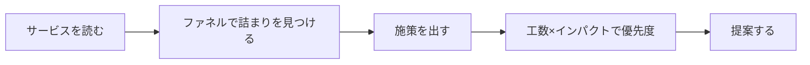
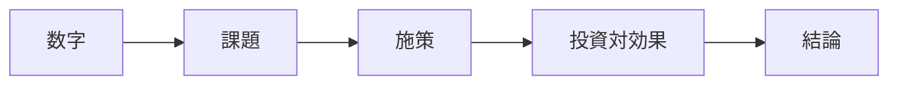

# ステップ0　目的

## 今日、何をやり切る日か

今日のゴールは1つです。

**GTMエンジニアの一連の流れを、実データで、最後まで通しでやり切る。**

ここで「一連の流れ」と言っているのは、こういう順番です。



左から右へ、止まらず1本につなぐ。これが今日やり切る流れです。

前回までの授業では、この流れを「分かる」ところまでやりました。今日は、それを「できる」に変える日です。座学はもう終わりです。今日は自分の手を動かして、この5つを1周します。

---

## なぜ「通しで」やるのか

エンジニアの仕事でよくあるのが、途中まではやるけど最後まで通さない、という状態です。

- サービスは触ったけど、ファネルは描いていない
- 数字は出したけど、それで終わっている
- 施策は思いついたけど、どれからやるかは決めていない

途中で止まると、結局「言われたものを作って終わり」に戻ってしまいます。データを出しただけ、ファネルを描いただけでは、売上は1円も動きません。

だから今日は、最初から最後まで1本につなぎます。サービスを読むところから、提案で「だからこれを先にやる」と言い切るところまで。**途中を飛ばさない、というのが今日いちばん大事なルール**です。

---

## なぜこの順番なのか

この5ステップは、順番に意味があります。逆にやると、ほぼ確実にズレます。1つずつ、なぜその順番なのかを見ておきます。

### 先に「サービスを読む」

いきなり「この機能を作りましょう」「このSQLを叩きましょう」とやりたくなります。でも、それを先にやると、**どこに技術を使えば売上に効くのかが判断できません。**

サービスを読むというのは、点ではなく流れで見るということです。お客さんがどう入ってきて、どう登録して、どこで価値を感じて、どこでお金が発生するのか。この流れ全体を1枚にする。これがファネルです。

ここを飛ばすと、「便利そうだから作る」になります。今日は、まずサービスを読みます。

### 次に「データで詰まりを見つける」

サービスを読んで描いたファネルは、まだ仮説です。「たぶんここで落ちてるんじゃないか」という当たりをつけた状態です。

本当にどこで落ちているかは、データを見ないと分かりません。ここで初めてSQLを叩きます。**順番が逆ではない、というのが肝心です。** 概念（ファネル）が先、データ（SQL）が後。先にSQLに飛ぶと、何のために何を数えているのか分からなくなります。

これは、皆さんが普段やっているデバッグと同じ構造です。バグが出たとき、当て推量では直しませんよね。ログを仕込んで、どこまで処理が通って、どこで止まったかを特定して、そこを直す。ファネル分析もまったく同じです。

- 数字が落ちている箇所　＝　バグ
- 各段の人数を数える　＝　ログを仕込む
- こぼれている段を特定　＝　止まった箇所の特定
- そこに施策を打つ　＝　そこを直す

やっていることは普段の仕事の応用です。それを、コードではなく事業に向けるだけです。

### そのあと「施策を出す」

詰まりが見つかったら、それを解く施策を出します。ここでのコツは、**質より量**です。1つの詰まりに対して、最低3つ。良し悪しの判断はここではしません。切り口を変えて、思いつく限り出します。

なぜ量かというと、最初から1つに絞ると、視野が狭くなるからです。まず広げて、絞るのは次のステップでやります。

### それから「工数×インパクトで優先度をつける」

施策が並んだら、どれからやるかを決めます。ここで使うのが2つの軸です。

- **工数**　＝　実装に何時間かかるか
- **インパクト**　＝　どれくらい売上に効きそうか

この2軸がないと、優先度は決められません。「全部やりたい」では現場は動きません。短い時間で大きく効くものから着手する。これが基本です。いきなり工数の大きいもの（決済の作り替えなど）に飛びつかない。

### 最後に「提案する」

ここまで来て、ようやく提案です。提案の骨はいつも同じ順番です。



根拠（数字）から始めて、最後に「だから何を先にやるか」で言い切る型です。

まず自分たちが出したファネルの数字（根拠）を見せる。その数字から詰まり（課題）を名指す。それを解く施策を出す。工数とリターンで投資対効果を示す。最後に「だから何を先にやるか」を結論で言い切る。

数字だけで終わらせない。「だから何をするか」まで言い切って、初めて提案になります。

---

## 「分かる」を「できる」にする

今日は実践の日です。聞いて終わりにしません。

今日が終わったとき、手元にこれが残っているのがゴールです。

- 自分（チーム）で描いたファネル
- 各段の通過率（実データから出した数字）
- どこを先にやるかまで言い切った提案資料

これらが残っていれば、今日のゴールは達成です。逆に、頭で分かっただけで成果物が手元になければ、まだ「分かる」止まりです。

---

## チーム分け

今日のワークは、全部チーム単位で進めます。

チームは2つの見方に分かれます。

- **管理画面側**　＝　管理者の動き（登録・設定・運用）を見る側
- **ユーザー側**　＝　利用者の動き（流入・利用・課金）を見る側

なぜ分けるかというと、同じサービスでも、入口が違うと見える詰まりが変わるからです。管理者の側から見える詰まりと、利用者の側から見える詰まりは、別の場所にあります。最後にお互いの見え方を突き合わせると、サービス全体の絵が立体的になります。

ワークは、ファネル描き・SQL・施策出し・提案まで、全工程チームで動きます。一人で抱え込まない。詰まったら個人でなくチームで拾う。手分けして、全員が1周します。

---

## 今日の進め方（流れの全体像）

これから進めていく順番を、もう一度1枚で。

```
ステップ0  目的（今ここ）
ステップ1  セットアップ（全員が同じデータを見る）
ステップ2  サービス／ファネル整理（流れを1枚に描く）
ステップ3  SQLで詰まり特定（データを当てる）
ステップ4  改善点を洗い出す（施策を最低3つ）
ステップ5  工数×インパクトで優先度
ステップ6  提案＆発表
ステップ7  持ち帰り
```

この順番のまま、上から下へ進みます。途中を飛ばさない。これだけ意識しておいてください。

---

→ ワーク：ワークシート（`../ワークシート.html`）の該当ステップをやる
