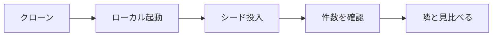
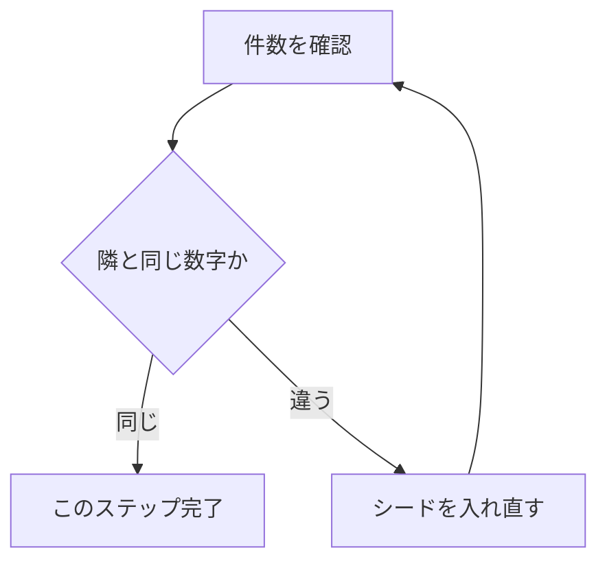

# ステップ1 セットアップ

## このステップでやること

ここでは、まだ何も考えなくていい。

ファネルとは何か、どこが詰まっているか、SQLをどう書くか。そういう話は全部この後に来る。今はまだ早い。

このステップでやるのはひとつだけ。

**全員が、自分のPCで、同じサービスの同じデータを見られる状態にする。**

これだけ。本当にこれだけ。

---

## なぜ最初に「動かす」のか

データ分析の授業なのに、いきなり概念から入らない。これには理由がある。

セットアップは、地味だけど一番事故が起きるところだ。

「全員クローンして動かしておいてね」と言って先に概念の話を始めると、必ずこうなる。誰かのDockerが起動していない。誰かのデータが入っていない。誰かは件数が違う。そのまま進むと、後半のSQLのワークで「自分だけ数字が合わない」が発生する。

そうなると、原因が2つに割れる。**SQLの書き方を間違えたのか、そもそも見ているデータが違うのか。**ここが切り分けられなくなると、デバッグできない。

だから先に潰す。**今このステップで全員のデータを揃えておけば、後半で数字が違ったときに「これはSQLの問題だ」と一発で分かる。**揃った状態を先に作る。これは時間の節約であって、回り道ではない。

---

## ゴールはひとつだけ

成否の基準はシンプルだ。

> **手元で、同じテーブル・同じ件数が見えているか。**

これが見えていればOK。見えていなければ、まだここから先に進まない。

「だいたい動いてる気がする」では進まない。隣の人と件数を見比べて、ピタッと同じ数字が出ていること。これが確認できて、はじめてこのステップは終わる。

---

## 流れ

やることを大きく言うと3つ。

1. **クローンする** — リポジトリを自分の手元に落とす。全員が同じソースから始める。
2. **ローカルで起動する** — 手元でサービスを立ち上げ、シードを入れて全員同じ初期データにする。
3. **同じ件数が見えるか確認する** — 隣の人と見比べて、揃っていることを確かめる。

具体的なコマンドやコピペ用の手順は、別紙のハンズオン手順書（`01_環境構築.md`）にまとめてある。ここではそれを「なぜそうするのか」と一緒に押さえておく。

全体の流れはこの一本道。最後の「隣と見比べる」まで通って、はじめて揃ったと言える。

---

### 1. クローンする

まずリポジトリを自分のPCに落とす。

全員が同じ場所から落とすことが大事だ。誰かが古いものを触っていたり、自分でいじったファイルが混ざっていると、その時点でデータがズレる。全員が同じソースからスタートする。これが揃える第一歩になる。

落としたら、その中に2つのフォルダがあるのを確認しておくとよい。

- `supabase/` — データの中身（スキーマとシード）が入っている。今日叩くデータの本体。
- `mock/` — サービスの画面イメージ（静的HTML）。後で「どんなサービスか」を体感するときに開く。

> 今日の主役は `supabase/` の中のデータの方だ。`mock/` の画面はあくまで「どんなサービスか」を体で感じるためのもので、数字の判断には使わない。詰まりはすべてデータ（SQL）で出す。これは後のステップで効いてくる前提なので、頭の隅に置いておく。

### 2. ローカルで起動する

次に、手元でサービスを立ち上げる。

ここで大事なのは、**本番ではなく自分のPCの中のコピーを触っている**ということ。誰かが何かを壊しても、誰にも迷惑がかからない。だから安心して触れる。今日は遠慮なく叩いていい環境を、まず自分の手元に作る。

起動すると、決まったデータ（シード）が自動で入る。このシードは、何回入れ直しても**毎回まったく同じ件数・同じ数字**になるように作ってある。だから「自分のだけ数字が違うかも」という不安が出たら、入れ直せばいい。入れ直して直る。ここは怖がらなくていいところだ。

### 3. 同じ件数が見えるか確認する

最後に、データが正しく入ったかを確認する。

確認用の数字がひとつ決まっている（別紙参照）。その数字がピタッと出れば、データは正しく入っている。

ここで終わりにせず、**隣の人と見比べる。**自分も隣も同じ数字が出ていれば、2人とも揃っている証拠になる。もし違っていたら、どちらかのシードが入りきっていない。その場合は入れ直す。揃うまでがこのステップだ。

「だいたい合ってる」では先に進まない。揃うまではこのループを回す、という考え方。

---

## 詰まったら、ひとりで止まらない

セットアップは、人によって詰まる場所が違う。Dockerが起動していない、ポートが他のもので埋まっている、データが入りきらない。よくあるやつだ。

ここで一番やってほしくないのが、**ひとりで黙って10分も20分も止まること。**

セットアップで止まるのは、能力の問題ではない。環境の問題だ。誰でも踏む。だから、

- 詰まったら、すぐ隣に「ここで止まってる」と言う
- 動いた人は、止まっている人の画面を一緒に見る
- チームで巻き取って、早めに同じスタートラインに戻す

これでいい。全員が同じデータを見られて、はじめて次のステップ（サービスを読んでファネルを描く）に全員で進める。逆に言えば、ひとりでも揃っていないと、その人は後半で迷子になる。だからここは、チーム全体で「全員揃った」を作りにいく。

---

## このステップで持っておく感覚

- 今は概念を覚えなくていい。**まず動かす。**
- ゴールは「同じテーブル・同じ件数が見えている」こと。それ以上でもそれ以下でもない。
- 触っているのは手元のコピー。**壊しても大丈夫。**おかしくなったら入れ直せば、必ず同じデータに戻る。
- 詰まりは環境のせい。**ひとりで抱えず、チームで揃える。**

ここが揃うと、この後のワークは全員が同じ土俵で進められる。逆にここを雑にすると、後半ずっと「自分だけ数字が合わない」に振り回される。だから、地味だけど一番大事なステップだと思って、丁寧に揃えてほしい。

---

→ ワーク：ワークシート（`../ワークシート.html`）のステップ1をやる。
