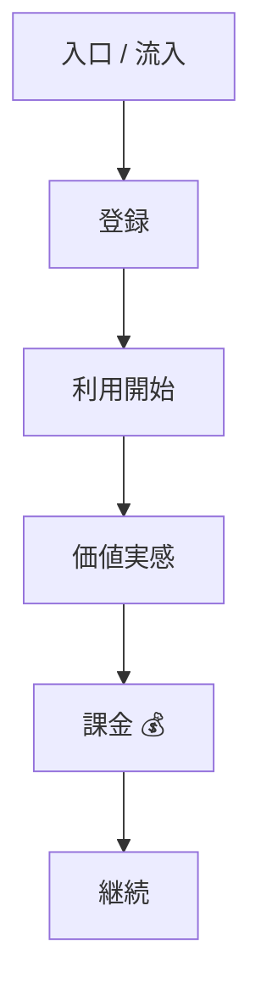
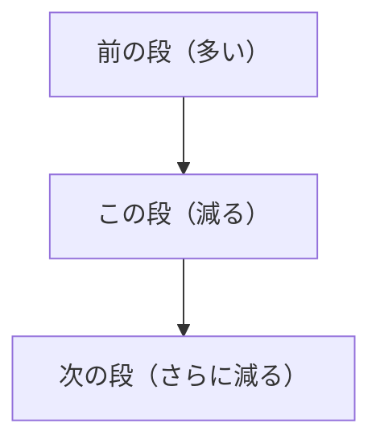

# サービスとファネルを整理する

ここからが今日の核になる。

前のステップで、全員が同じデータを手元で見られる状態になった。サービスも起動できている。ここで多くの人がやりたくなるのが、「じゃあ何の機能を作ろう」「どのテーブルをSQLで叩こう」という発想だ。

今日はそれをやらない。

先に釘を刺しておく。**いきなり機能案やSQLに飛ばないこと。** 飛んだ瞬間に、自分が何のために手を動かしているのか分からなくなる。「どこに技術を使うべきか」を判断できないまま、なんとなく作って終わる。それは前回さんざん話した「作業者」の動き方だ。

このステップでやるのは、ただ1つ。**サービスを、点ではなく流れで読む。** これだけに集中する。

---

# まず見るのは2つだけ

GTMエンジニアがサービスに入って最初に見るものは、2つしかない。

1. サービスの全体像（流れ）
2. キャッシュポイント

機能案でもなく、SQLでもなく、UIの粗探しでもない。この2つだけだ。

なぜこの2つかというと、この2つが分からないと「どこを改善すると売上に効くのか」を決められないからだ。改善する場所が決まらないのに、いきなり改善案を出しても、それは当てずっぽうになる。

順番に見ていく。

---

# ① サービスの全体像を見る

サービスの全体像を見るとは、**ファネルを理解すること**だ。

ファネルというのは、お客さんがそのサービスを使っていく順番のことだった。前回マッチングアプリの例で話した、「いいねする → マッチする → 返信が来る → 会う約束が取れる → 当日会う → 続く」という、あの流れと同じだ。

ここで一番大事なのは、**点で見るのではなく、流れで見る**ということ。

「登録画面がある」「商品一覧がある」「決済がある」。こうやって機能を点でバラバラに見ても、サービスは分からない。お客さんは点を見ているわけではなく、入口から出口まで1本の道を歩いている。その道を、お客さんと同じ目線でたどる。

具体的には、こういう問いでサービスを読んでいく。

- どうやって入ってくるのか（流入）
- どうやって登録するのか
- どうやって使い始めるのか
- どこで「これいいな」と価値を感じるのか
- どこでお金が発生するのか
- どこで継続したり、もう一度買ったり、逆に離れたりするのか

この一連の流れを、頭の中ではなく**1枚の紙の上に並べる**。これが「全体像を見る」ということだ。

イメージとしては、こういう「上から下への1本の道」になる。

上から下へ、お客さんが歩く順に並べる。💰はお金が発生する地点（キャッシュポイント）の例。※これは「並べ方の例」であって、自分が触るサービスの正解の段ではない。段は自分で決める。

---

# 流れにすると、何が見えるか

点を流れにすると、見え方が変わる。

たとえば「決済機能」を点で見ると、「決済ができる/できない」しか分からない。でも流れの中に置くと、「価値を感じた人が、ここでお金を払う段」として見える。前の段から何人来て、ここで何人が払うのか、という見方ができるようになる。

これが流れで見ることの意味だ。各段は、お客さんが通っていく**チェックポイント**になる。1段進むごとに、必ず人は減っていく。全員が次の段に進むことはない。

各段は前から流れてきた一部だけが通る。だから1段ごとに人は減る（数はイメージ。実際の通過率はまだ出さない）。

この「減っていく」という性質を頭に入れておく。後のステップで、ここが効いてくる。

---

# ② キャッシュポイントを見る

2つ目に見るのが、キャッシュポイントだ。

キャッシュポイントとは、**サービスの中で売上や利益が発生する場所**のこと。お金が生まれる地点だ。

ここが分からないまま開発すると、どれだけ頑張っても売上につながらない。流れのどこかに、お金が発生する地点が必ずある。そこを見つける。

注意してほしいのは、**キャッシュポイントは1つとは限らない**ということ。

前回レアのようなSaaSの話をした。あのサービスだと、管理者から取る月額もキャッシュポイントだし、ショップの取引額（GMV）にかかる手数料も別のキャッシュポイントだ。1本の流れの中に、お金が発生する地点が複数あることは普通にある。月額・手数料・追加課金、いろいろなパターンがある。

だから、自分が触っているサービスにキャッシュポイントがいくつあるのか、それぞれどこにあるのかを、流れの上で見つけていく。

そして見るときの目線はこれだ。**どこが伸びると、売上が増えるのか。**

---

# 全体像とキャッシュポイントが揃うと

この2つが見えて、はじめて次の問いが立てられる。

> どこを改善すると、売上にインパクトが出るのか？

ファネル（流れ）が見えていて、お金が発生する地点（キャッシュポイント）も見えている。だから、「この段を直すと、このキャッシュポイントの数字が動くな」とつなげて考えられる。

逆に、流れもキャッシュポイントも見えていないのに改善案を出すと、「便利そうだから作る」になってしまう。それは数字につながらない。GTMエンジニアは「この数字のために作る」と言える状態を、まずここで作る。

---

# 理解が先、詰まりは後

ここで順番を間違えないでほしい。

今日のこのステップでやるのは、**流れを理解すること**まで。「どこが詰まっているか」を数字で突き止めるのは、次のステップだ。

なぜ分けるのか。流れの全体像が頭に入っていないのに、いきなり「ここが詰まってる」と言っても、それはただの思いつきになる。地図がないのに「この道が混んでる」と言っているようなものだ。まず地図を描く。詰まりを探すのは、地図ができてから。

だから今は、**詰まりの数字をまだ出さない**。ここで数字に飛びつきたくなる気持ちは分かるが、ぐっとこらえる。今は流れを1枚に描き切ることだけに集中する。詰まりは次のステップで、データを当てて確かめにいく。

---

# 各段で「見るべき指標」を置く

流れを1枚に描いたら、もう1つだけやることがある。

各段に、**数えるべき数字を1つ置く**。

たとえば「登録」の段なら登録した人数、「課金」の段なら払った人数、という具合だ。人数なのか、率なのか、金額なのか、その段で何を数えれば状態が分かるかを考えて、1つ置く。

ここで気をつけたいのは、**単に「売上」だけを見ないこと**。売上は一番最後の結果でしかない。流れの途中、各段それぞれに数字を置くから、後で「どの段で人がこぼれているか」が見えるようになる。途中に数字がないと、結果が悪かったときに、どこが原因か分からない。

繰り返すが、ここで置くのは「この段では何を数えるか」という**指標の名前**まで。**実際の数字（通過率など）はまだ出さない。** それは次のステップで確かめる。今は「この段はこの数字を見る」と決めるところまでだ。

---

# まとめ

このステップで腹に落としてほしいのは、次の通り。

1. いきなり機能案やSQLに飛ばない。先に流れを読む
2. 最初に見るのは2つだけ。①サービス全体像（流れ＝ファネル）②キャッシュポイント
3. 点ではなく流れで見る。各段はお客さんが通るチェックポイント
4. お金が発生する地点（キャッシュポイント）は複数あってよい
5. まず流れを理解する。詰まりを数字で見るのは次のステップ
6. 各段に「見るべき指標」を1つ置く（数字そのものはまだ出さない）

地図ができれば、次に「どこが渋滞しているか」をデータで突き止めにいける。今日はその地図を、自分の手で1枚描く。

---

→ ワーク：[ワークシート](../ワークシート.html)の該当ステップ（ステップ2：サービス／ファネル整理）をやる。サービス（モック）を実際に触って流れを追い、入口からお金が発生するまでのファネルを1枚に描く。段は自分で決める。お金が発生する地点（キャッシュポイント）に丸をつけ、各段に「見るべき指標」を1つ置く。※詰まりの数字はまだ出さない。
