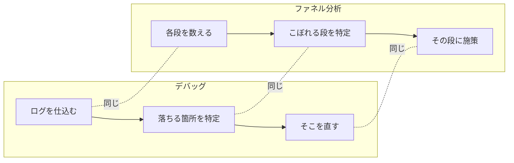

# ステップ3：SQLで詰まりを特定する

## ここまでで描いたファネルは、まだ「仮説」

前のステップで、サービスを触ってファネルを1枚描いてもらった。入口から、お金が発生するところまで。各段に「見るべき指標」も置いた。

ここで一度ブレーキを踏んでほしい。

そのファネル、まだ**頭の中で組んだ仮説**でしかない。

サービスを触っていると、なんとなく「ここが弱そう」「ここで離脱してそう」という感覚が出てくる。でもそれは、あくまで触ってみた印象だ。実際にどこで人がこぼれているかは、**データを見るまで分からない**。

ここでよくあるのが、感覚で詰まりを決めつけて、そのまま施策に飛んでしまうケース。「たぶんここが詰まってる」で動くと、実は詰まってもいない段に手を打って、時間だけ溶ける。前のステップで写真の話をしたのと同じだ。マッチしない原因が写真なのに、トークの練習をしても意味がない。**詰まっている場所を間違えると、何をやっても効かない。**

だから、今からデータを取りに行く。仮説に実データを当てて、本当の詰まりを突き止める。

---

## これは、君たちが普段やっている「デバッグ」と同じ

「データ分析」「ファネル分析」と聞くと、なんだか専門的で身構えるかもしれない。でも、やることは君たちが毎日やっている**デバッグと全く同じ構造**だ。

バグが出たとき、当て推量で直そうとはしないはずだ。「たぶんこの関数かな」で書き換えたりしない。まず `console.log` を仕込んで、処理がどこまで通って、どこで止まったかを特定する。止まった箇所が分かってから、そこを直す。

ファネル分析も、これとそっくり同じことをやっている。

| デバッグ | ファネル分析 |
|---|---|
| バグ ＝ どこかで処理が落ちている | 数字が落ちている箇所 |
| `console.log` を仕込む | 各段の人数を数える |
| どこで止まったかを特定する | こぼれている段を特定する |
| その箇所を直す | その段に施策を打つ |

つまり、

- **詰まり＝バグ**
- **各段の人数＝ログ**
- **値が止まった箇所＝こぼれている段**
- **そこを直す＝施策を打つ**

同じ「探して→特定して→直す」の流れを、コードと事業で並べるとこうなる。

左右で、やっていることの形がそのまま重なる。

やっていることは、普段の作業の応用でしかない。コードに向けていたデバッグの目を、事業に向けるだけだ。

エンジニアは普段からログを読み、条件を追い、データの流れを頭の中で組み立てている。この力はすでに身についている。だから、ここは怖がらなくていい。**むしろ得意なはずの場所**だ。

---

## 通過率は「前段で割るだけ」

各段に人数を当てたら、次は通過率を出す。

通過率の計算は、めちゃくちゃ単純だ。**その段の人数を、1つ前の段の人数で割るだけ**。

ファネルを各駅停車の電車だと思ってほしい。最初の駅で何人か乗って、駅ごとに人が降りていく。「次の駅まで残ったのは、前の駅にいた人の何%か」を1駅ずつ見ていく。それが通過率だ。

ここで一番やりがちなミスを、先に潰しておく。

### 割る相手は「すぐ前の段」。全体や登録数で割らない

たとえば、ある段の通過率を出したいとする。

- ⭕ 正しい：その段の人数 ÷ **すぐ前の段の人数**
- ❌ 間違い：その段の人数 ÷ 一番最初の登録数（や全体の数）

なぜ最初の数で割ってはいけないのか。

最初の数（登録数など）で全部割ってしまうと、後ろの段にいくほど数字が小さくなるのは当たり前になる。それだと「**どの区間でガクッと落ちたのか**」が消えてしまう。全体的に右肩下がりにしか見えなくなって、どこが犯人か分からなくなる。

分母を「すぐ前の段」にするからこそ、「この区間だけ極端に落ちている」という**犯人の足跡**が浮かび上がる。

割り算をしているだけなのに、ここを間違えると分析そのものが崩れる。**分母は必ず1つ前の段**。これだけは絶対に外さないでほしい。

---

## 低い段を「ベンチ」と比べて判定する

通過率が全部出そろった。でも、数字を並べただけでは、まだ「どこが詰まりか」は分からない。

たとえば、ある段の通過率が出たとして、その数字が高いのか低いのか、その段だけ見ても判断できない。区間によって「通って当たり前の段」と「もともと落ちやすい段」があるからだ。入口に近い段はたくさん通って当然だし、お金が発生する手前の段はそもそも絞られて当然だったりする。

だから、**「普通ならこれくらい通るよね」という基準（ベンチ）と並べて比べる**。

各段の通過率の横に、「この段なら通常これくらいは見込める」という目安を置く。そのうえで、各段をこの3つに仕分けていく。

- **低すぎる** … ベンチから大きく外れて低い。ここが詰まりの候補
- **あと一歩** … ベンチには届いていないが、惜しい
- **伸ばせる** … ベンチは超えているが、まだ上を狙える余地はある

ここで大事なのは、**「数字が小さい段＝詰まり」ではない**ということ。

後ろの段の通過率が小さく見えても、それが「その段なら普通そんなもん」なら、詰まりではない。逆に、一見そこそこの数字でも、ベンチからガクッと外れていればそこが詰まりだ。

イメージはこう。各段の通過率を並べたとき、1段だけガクッと外れて低いところがある（数字はダミー）。

この「⚠ 1段だけ落ちている」を探すのが目的。段名・数字は一般例で、本物は自分たちで当てる。

**他の段から大きく外れて低い段＝詰まり。** 自分の感覚で「ここが弱そう」と思っていた段と、実際に外れていた段が違うことは、普通に起きる。それでいい。むしろ、感覚と実データのズレに気づけたら、それはこのステップが効いている証拠だ。

> ベンチの数字そのものは、ここでは渡さない。何%が普通なのかは、自分たちで調べて、考えて、置いてほしい。サービスの性質を踏まえて「この段ならこれくらいは通るはず」と当てにいくこと自体が、データを読む力になる。

---

## マーケは人に頼む。エンジニアは、自分で取りに行ける

ここがエンジニアの一番の強みだ。

マーケの担当者は、こういう数字が欲しいとき、たいてい誰かに依頼する。「この期間の各段の人数を出してください」とエンジニアやデータ担当に頼んで、出てくるのを待つ。そして待っている間、分析は止まる。

エンジニアは違う。**自分でSQLを書いて、自分でデータを取りに行ける**。

各段の人数を数えるのも、ユニークなユーザー数を数えるのも、2回以上やった人を数えるのも、やっていることは結局「数える」だけだ。前回の授業でも触れたとおり、この程度の集計はそんなに難しいものじゃない。書けなくても、今はAIに書かせることもできる。

「数字が欲しいときに、人を介さず、自分で今すぐ取れる」。これは、エンジニアだからこそ持てる武器だ。今日はその武器を、実際に使う。

---

## やること：各段に実データを当てて、詰まりを名指す

ここからが手を動かすパートだ。チームで、描いたファネルに実データを当てていく。

手順はこの流れ。

1. **各段の人数を、SQLで出す**
   - ステップ2で描いたファネルの各段が、実際に何人通っているかを数える
   - 「人数」を数えるのか「件数」を数えるのか、その段で見るべきものは何かを意識する（同じ人が複数回やっている段なら、人で数えるのか回数で数えるのか）
2. **前段で割って、通過率にする**
   - 各段の人数を、すぐ前の段の人数で割る
   - 分母は必ず1つ前の段。最初の数や全体では割らない
3. **ベンチと並べて、外れて低い段を名指す**
   - 各段の通過率の横に「普通ならこれくらい」を置く
   - 「低すぎ／あと一歩／伸ばせる」で仕分ける
   - 他段から大きく外れて低い段＝詰まり、として**自分たちの言葉で名指す**

ゴールは、「うちのファネルは、**この段が詰まっている**」と、チームで言い切れること。感覚ではなく、**出した数字を根拠に**言えることだ。

注意：

- **SQLそのものは渡さない。** どう書けば各段の数字が出るかは、自分たちで考えて書く。詰まったらAIに書かせてもいいが、出てきた数字が何を数えているかは必ず自分で理解すること
- **正解の通過率も渡さない。** 「この段は何%なら詰まり」という答えは配られない。数字を出して、ベンチと比べて、自分たちで判定する
- 概念（どこを見るか・どう割るか）を先に握ってから、SQLを書く。いきなりクエリから入らない

---

## このステップの肝

- 描いたファネルは仮説。**実データを当てて初めて、本当の詰まりが分かる**
- ファネル分析は**デバッグと同じ**。詰まり＝バグ、各段の人数＝ログ
- 通過率は**前段で割るだけ**。分母を間違えると、犯人の足跡が消える
- **ベンチと比べて、外れて低い段＝詰まり**。数字が小さい段が詰まりとは限らない
- 数字を、感覚ではなく**根拠として**詰まりを名指す

---

→ ワーク：ワークシートのステップ3「SQLで実データを当てて、詰まりを名指す」をやる。各段の人数をSQLで出し、前段で割って通過率にし、ベンチと並べて、外れて低い段＝詰まりを自分たちで名指してください。
