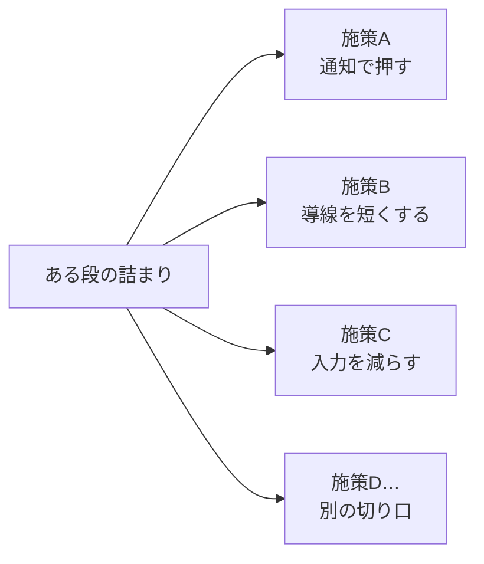

# ステップ4 改善点を洗い出す

ステップ3で、あなたはファネルの各段に実データを当てて、「ここが詰まっている」という段を自分で名指したはずだ。

その段の通過率が、他の段から大きく外れて低い。ここに人がこぼれている。これが、あなたが見つけた詰まりになる。

ここからが、このステップでやることだ。**見つけた詰まりを、どう解くか。その案を出していく。**

---

## まず、ここで止まる人がいちばん多い

正直に言う。多くのエンジニアは、ステップ3で終わってしまう。

数字を出して、「ここが詰まっていますね」と分かったところで満足する。きれいな表ができて、スプレッドシートに通過率が並んで、なんとなく仕事をした気になる。

でも、それは前回も言った通り、まだデータ分析ではない。

数字を出すのは「データの構築」で、その数字を見て次の一手を決めるのが「データ分析」だ。詰まりが分かっても、何もしなければ数字は1ミリも動かない。

> データを出すのは、行動を変えるためだ。

ここを忘れないでほしい。出して終わりにしない。だからこのステップでは、見つけた詰まりに対して「じゃあ何をするか」を、必ず案として出す。

---

## このステップのルール：質より量

ここでやることは、シンプルだ。

**詰まりを解く施策を、思いつく限り全部出す。**

ポイントは、ここでは良し悪しを判断しないこと。

「これは工数がかかりそう」「これは効果が薄そう」――そういう評価は、次のステップ（工数×インパクト）でやる。今この段階でやると、手が止まる。

なぜ止まるか。頭の中で「出す人」と「ダメ出しする人」が同時に動くと、出した瞬間に否定が入って、アイデアが死ぬからだ。だから、ここでは出す人だけを動かす。評価は後回しにする。

イメージはブレストだ。

- いったん全部机の上に並べる
- バカみたいに見える案でも書く
- 良いか悪いかは見ない、数だけ見る

質より量。これがこのステップの合言葉になる。

---

## 1つの詰まりに、最低3つ

ただ「たくさん出せ」だと、つかみどころがない。だから具体的な縛りを置く。

**1つの詰まりに対して、施策を最低3つ出す。**

詰まりが2つ見つかったなら、施策は最低6つ。詰まりが3つなら最低9つ、ということになる。

なぜ「3つ」なのか。1つや2つだと、最初に思いついた案にすぐ飛びついて、それで決め打ちしてしまうからだ。最初の案がベストとは限らない。3つ出そうとすると、嫌でも別の角度から考えることになる。その「別の角度」の中に、当たりが混ざっている。

「最低」3つだから、4つでも5つでも、出るなら出していい。多いほどいい。

---

## いちばん大事なのは「切り口を変える」

ここがこのステップのキモだ。よく聞いてほしい。

3つ出せと言われると、似たような案を3つ並べてしまう人がいる。たとえばカゴ落ちの詰まりに対して、

- リマインドを送る
- リマインドの文面を変える
- リマインドを2回送る

――これ、全部「リマインド」の話だ。1つの方向しか見ていない。これだと3つ書いても、実質1案と変わらない。

そうではなく、**詰まっている原因の方向を変えて、別々の切り口から案を出す。**

切り口の例を挙げておく。これを引き出しとして持っておくといい。

- **通知で押す** … 忘れているお客さんに、こちらから声をかける（リマインド、再アプローチ）
- **導線を短くする** … ゴールまでのクリック数・画面数を減らす（ステップを飛ばす、ショートカットを作る）
- **入力を減らす** … 面倒な入力をなくす・自動で埋める（項目削減、初期値、自動入力）
- **不安を消す** … 進めない理由＝迷いや不安を取り除く（説明を足す、保証を見せる、料金を先に出す）
- **見せ方を変える** … そもそも見えていない・気づいていないものを、見える場所に置く

同じ詰まりでも、「通知で押すなら？」「導線を短くするなら？」「入力を減らすなら？」と、切り口ごとに考えると、自然と別々の案が出てくる。

1つの詰まりを起点に、切り口を変えて施策を広げる。イメージはこうだ（施策名・切り口は一般例）。

詰まりは1つでも、出口（施策）は何本にも分かれる。この「枝が分かれている」状態を作るのがこのステップだ。

3つの案が、3つの別々の切り口から出ていれば合格。同じ切り口で3つなら、まだ足りない。

---

## 詰まりの「原因」から逆に考える

切り口を変えると言っても、最初は出しにくいかもしれない。そういうときは、こう考える。

**「なぜ、この段でお客さんはこぼれているのか？」**

詰まりは、お客さんが次に進めなかった結果だ。進めなかったのには、理由がある。その理由を想像すると、施策は出しやすくなる。

たとえば「カートに入れたのに買わなかった」という詰まりがあったとする。なぜ買わなかったのか、理由を並べてみる。

- 後で買おうと思って、そのまま忘れた → だったら**通知で思い出させる**
- 決済の入力が面倒で離脱した → だったら**入力を減らす**
- 送料がいくらか分からず不安だった → だったら**不安を消す（料金を先に見せる）**

原因を1つ想像するごとに、それに対応する施策が1つ出る。原因を3つ想像すれば、施策も3つ出る。しかも、自然と切り口がバラける。

これは、あなたが普段やっているデバッグと同じ考え方だ。バグが出たとき、「なぜここで止まったか」を考えて原因を当てにいくだろう。それと同じで、「なぜここでこぼれるか」を考えて、原因ごとに手を打つ。

---

## ここでは「正解」を出さなくていい

念のため言っておく。

ここで出す施策は、まだ仮説だ。本当に効くかどうかは、やってみないと分からない。だから、この段階で「これが正解だ」と当てにいく必要はない。

外れてもいい。むしろ、外れそうな案も机の上に並べておくほうがいい。次のステップで工数とインパクトの2軸にかけたとき、思わぬ案が「短時間で効きそう」の象限に入ってくることがあるからだ。

今は、選ぶ前の段階。**選択肢をどれだけ広げられるか**が、このステップの勝負になる。狭く絞った3つより、広く散らした3つのほうが、次のステップで良い判断ができる。

---

## このステップでの確認ポイント

手を動かす前に、自分でチェックしてほしい。

- 詰まりを、ちゃんと「詰まりごと」に分けて書いたか（複数あるなら、混ぜずに分ける）
- 1つの詰まりに、施策を3つ以上出したか
- その3つが、別々の切り口から出ているか（通知／導線短縮／入力削減 …）
- 良し悪しの評価を、ここでしてしまっていないか（評価は次のステップ）

ここまでできていれば、次の「工数×インパクトで優先度をつける」に進む準備が整っている。

---

→ ワーク：[ワークシート](../ワークシート.html)のステップ4をやる。詰まりごとに、改善する施策を最低3つ、切り口を変えて書き出す。
