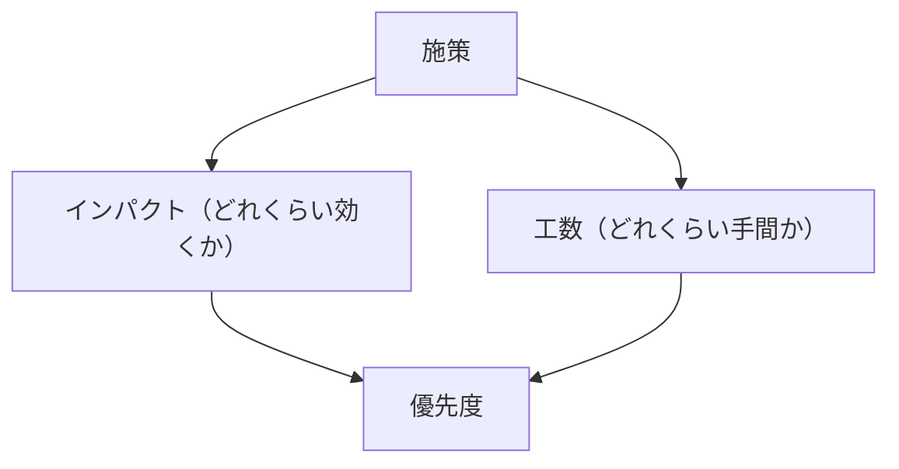
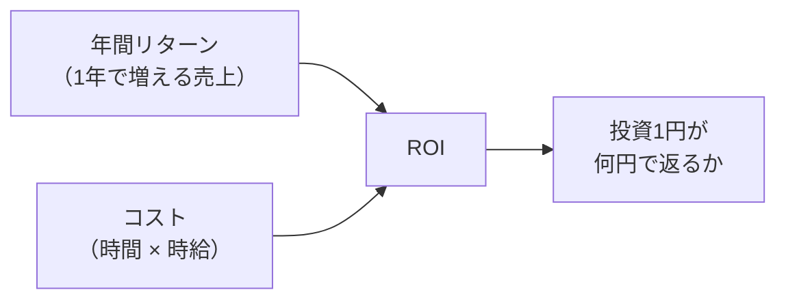
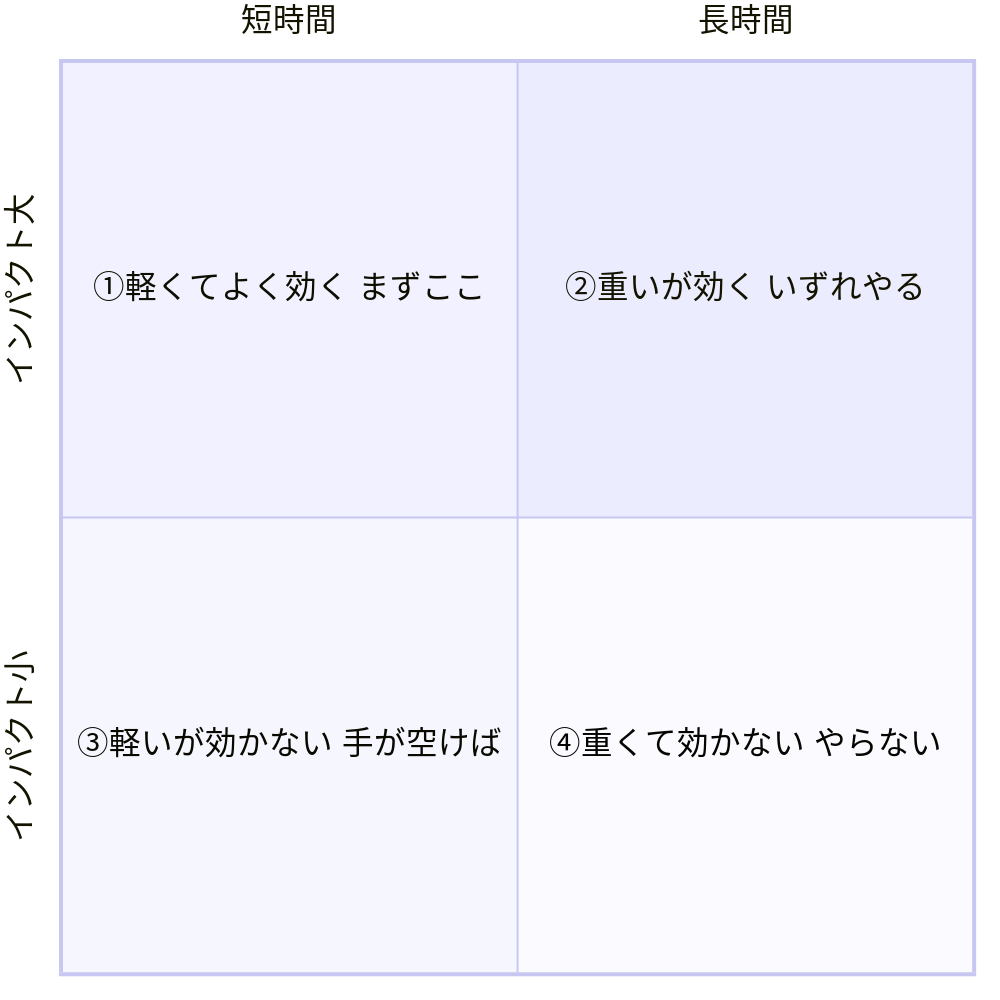

# ステップ5　工数×インパクトで優先度を決める

前のステップで、詰まりごとに施策をたくさん出した。質より量で、思いつく限り並べたはずだ。

ここからやることは1つ。その施策を、**どれから手をつけるか**決める。

施策が全部出そろうと、こう思いがちだ。「全部やればいいじゃないか」。でも、時間も人も無限じゃない。先にやるべきものと、後回しでいいものがある。それを決めずに上から順に着手すると、いちばん効く施策を後回しにしたまま、効きの薄いものに時間を溶かす、ということが普通に起きる。

だから、優先度をつける。そのための道具が、今日の「工数 × インパクト」の二軸だ。

---

## なぜ「二軸」がいるのか

優先度は、片方の軸だけでは決められない。ここを最初に押さえてほしい。

「インパクトが大きいから、これをやろう」。これだけだと危ない。インパクトは大きくても、実装に何ヶ月もかかる施策かもしれない。

「すぐ作れるから、これをやろう」。これも危ない。すぐ作れても、数字がまったく動かない施策かもしれない。

- インパクトだけで決める → 重いものに飛びついて、いつまでも成果が出ない
- 工数だけで決める → 軽いものばかりやって、数字が動かない

片方だけ見ると、必ずどちらかに転ぶ。だから**「どれくらい効くか（インパクト）」と「どれくらい手間がかかるか（工数）」の両方**を、同じ表に並べる。両方並べて初めて、「軽いのに、よく効く」施策がどこにあるかが見える。

優先度は、この二軸の掛け合わせで決まる。

片方の軸だけでは矢印が片側からしか来ない。両方そろって初めて優先度が決まる。

---

## 工数とは「何時間かかるか」

まず工数の軸から。

工数は、「大・中・小」みたいなふわっとした言葉では見積もらない。**実装に何時間かかるか**、時間で出す。

なぜ時間かというと、時間はそのままお金に換算できるからだ。エンジニアの時給を、ここでは5,000円とする。すると、

**コスト ＝ かかる時間 × 5,000円**

たとえば8時間かかる施策なら、コストは 8 × 5,000 ＝ 4万円。これが「その施策にいくら投資するか」の金額になる。

「大・中・小」だと、人によって大きさの感覚がバラつく。チームで「これは中くらい」と言っても、一人は10時間のつもり、もう一人は50時間のつもり、ということが起きる。時間に直せば、認識のズレが消える。チームで進めるとき、ここはそろえておく。

### 工数の目安（AIで実装する前提）

「とはいえ、何時間かかるか分からない」。最初はそうだ。だから目安を持っておく。今はCursorやClaude Codeで実装する前提なので、その前提での目安がこれ。

| 施策の種類 | 目安 |
|---|---|
| 文言・表示の変更 | 2〜4時間 |
| UI部品の追加・フォームの項目削減 | 4〜8時間 |
| 通知・メールの追加（リマインドなど） | 4〜8時間 |
| 画面フローの組み替え（ウィザード化など） | 12〜24時間 |
| 決済・課金ロジックの変更 | 40〜64時間 |

ここで2つ、勘違いしやすいポイントを言っておく。

**1つ目。「全部2時間」にしない。**

施策を出した直後だと、どれも軽く見えてしまう。「これくらいすぐ作れる」と全部に2時間と書きたくなる。でも、決済まわりをいじる施策と、ボタンの文言を変える施策が、同じ2時間で終わるわけがない。種類によって、かかる時間はまったく違う。そこを正直に見積もる。

**2つ目。AIを使っても縮まないものがある。**

文言変更やUI調整は、AIでかなり速くなった。でも、決済・課金まわりはそうはいかない。お金が動く処理は、テストも検証も慎重にやる必要があるし、外部の決済サービスとのつなぎ込みもある。ここは「AIで速くなるから2時間でいける」とはならない。40時間以上かかると見ておく。

この差が、後で効いてくる。「軽いUI改善」と「重い構造変更」を同じ表に並べたとき、工数の差がはっきりすると、優先度がくっきり見えるようになる。

---

## インパクトとは「単価 × 母数」

次にインパクトの軸。

インパクトは、その施策がうまくいったとき、**売上がどれくらい増えるか**。これも感覚で「効きそう」と言うのではなく、数字で出す。

インパクトの基本の式はこれ。

**リターン ＝ 単価 × 母数**

- **単価**　…　お客さん1人（または1件）あたり、いくら売上が立つか
- **母数**　…　その施策で何人（何件）増えるか

このとき、**母数はキャッシュポイントで数える**。ステップ2で、お金が発生する地点に丸をつけたはずだ。施策がそのキャッシュポイントを通る件数を何件増やすか、それが母数になる。

### 母数は「ファネルで読む」

ここがいちばん間違えやすいところだ。

施策は、ファネルのどこか1つの段の通過率を上げる。たとえば「カート → 注文」の通過率を上げる施策、とする。でも、通過率が何%上がったか、だけ見てはいけない。見るべきは、最終的に**お金が発生する段の件数が、何件増えたか**だ。

ファネルは1本につながっている。ある段の通過率が上がれば、その下流の段の件数も全部つられて増える。「カート → 注文」を改善したら、その先の「注文 → リピート」を通る件数も増える。だから、改善した段の%だけ見るのではなく、

1. 改善する段の通過率を Before → After で書く
2. そこから下流の段の件数を、既存の通過率で掛けていく
3. **最終的にキャッシュポイントの件数が何件増えたか**を出す
4. その増えた件数 × 単価 ＝ リターン

この順で出す。途中を飛ばして「○%改善 → リターン○円」とだけ書くと、根拠のない数字になる。「結局お金が発生する地点で何件増えたの？」に答えられないからだ。

詰まりの大きい段ほど、直したときの伸びしろが大きい。だからインパクトも出やすい。どこを直すか迷ったら、詰まりが深い段ほど効く、と覚えておく。

---

## ROIで同じ土俵に並べる

工数（コスト）とインパクト（リターン）が、それぞれ数字で出た。最後に、この2つを1つの数字にまとめる。それがROIだ。

**ROI ＝ 年間リターン ÷ コスト**

割り算で1つの数字にすると、性格の違う施策を横一列に並べられる。

- 年間リターンは、1年でいくら売上が増えるか
- コストは、さっきの「時間 × 5,000円」

ROIは「投資した1円が、何円になって返ってくるか」を表す。コストより年間リターンが大きいほどROIは高い（具体的な倍率は、自分が出した数字で計算する）。

なぜわざわざ割り算で1つの数字にするのか。理由は、**性格の違う施策を同じものさしで比べられるようにするため**だ。

軽いけど小さく効く施策と、重いけど大きく効く施策。リターンの金額だけ見ても、コストの時間だけ見ても、どっちが得か比べられない。でも「投資した分が何倍になるか」というROIにそろえれば、まったく違う施策どうしを、同じ土俵で横一列に並べられる。

リターンを計算するときは、混ぜてはいけない軸がある場合がある。サービスによっては、月額（固定の収益）が増える施策と、利用件数（変動の収益）が増える施策で、リターンの式が変わる。出口の収益が別なら、リターンの計算も別にする。同じ表でも、どっちの軸のリターンなのかは分けて書く。

---

## 着手は「短時間 × インパクト大」から

数字が出たら、いよいよ優先度を決める。

全施策を、二軸の表（マトリクス）に並べる。縦にインパクト、横に工数。すると、施策が4つの場所に散らばる。

> 注：4つの象限は「考え方の型」を示す例。点を打つ位置・順番は、自分が出した数字で決める。

着手する順番は、はっきりしている。

1. **まず「工数小 × インパクト大」（図の①）** ── 軽いのに、よく効く。最優先でここから取る
2. **次に「工数大 × インパクト大」（図の②）** ── 重いが、効く。時間はかかるが、いずれやる価値がある
3. **「工数小 × インパクト小」（図の③）** ── 軽いが、効きが薄い。手が空いたらでいい
4. **「工数大 × インパクト小」（図の④）** ── 重くて効かない。基本やらない

いちばんやってはいけないのが、**いきなり工数の大きいもの（決済改修など）に飛びつく**ことだ。重い施策は、効くかどうかも確かめにくいし、時間も溶ける。まず軽くてよく効くもので数字を動かして、成果を見せてから、重いものに取りかかる。これが基本の順番になる。

GTMエンジニアは、少ない工数でリターンが出る場所を探す。「最小工数で成果を出す」というのは、まさにこの「工数小 × インパクト大」の象限から取る、ということだ。

### 最後は「言い切る」

表に並べたら、優先度はほぼ一目で分かる。あとは、**何を先にやるかをはっきり言い切る**。

「これも大事、あれも大事」で終わらせない。「第1にこれ、第2にこれ、第3にこれ」と順番を決めて言い切る。提案のときに、根拠（数字）とセットでこの順番を出せると、説得力がまるで変わる。

---

## このステップでやること（まとめ）

1. 出した施策ごとに、**工数を何時間か**で見積もる（目安表を起点に）
2. それを **コスト（時間 × 5,000円）** に直す
3. 施策ごとに、**インパクト（リターン）** を「単価 × 母数」で出す。母数はファネルで下流まで読んで、キャッシュポイントの増加件数を出す
4. **ROI（年間リターン ÷ コスト）** を計算する
5. 全施策を **工数 × インパクトの表** に並べる
6. **着手順を言い切る** ── 短時間 × インパクト大から

---

→ ワーク：ワークシート（`../ワークシート.html`）のステップ5「工数×インパクトで優先度」をやる。出した施策を工数（時間）× インパクトの表に並べて、着手順を自分で決める。
