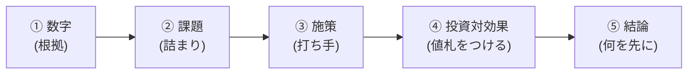

# ステップ6 提案＆発表

ここまでで、ファネルを描き、SQLで詰まりを名指し、施策を出し、工数×インパクトで優先度をつけてきた。

最後に、それを一本の提案にまとめて発表する。

ここが一番大事なところだ。先に結論を言っておく。

**分析は、アクションにつながって初めて価値が出る。**

---

## なぜ「提案」で締めるのか

これまでの工程を思い出してほしい。

きれいなファネルを描けた。SQLで通過率も出せた。詰まりも見つけた。施策も並べた。

でも、ここで止まったら、何も起きていない。

数字を出しただけでは、サービスの売上は1円も動かない。出した数字を見て、誰かが動いて、何かが変わって、初めて売上が動く。

だから提案がいる。提案とは、出した数字を「だから何をするか」まで言い切って、相手を動かす行為だ。

第2回で「データ分析の本質は、やりっぱなしにしないこと」と話した。提案はその出口にあたる。ここをやらないと、せっかくの分析が「出して終わり」になる。それは一番もったいない。

---

## 提案の骨は1本

提案資料は、凝った見せ方を考える前に、まず骨を1本通す。順番はこれで固定する。

**① 数字 → ② 課題 → ③ 施策 → ④ 投資対効果 → ⑤ 結論（何を先に）**

この順番には意味がある。1つずつ見ていく。

図にすると、提案は左から右へ一本でつながる。**「数字が先」で、課題はそこから自然に出てくる。**

左端の数字が抜けると、右側はすべて「感想」になる。だから必ず数字から始める。

### ① 数字（根拠）

最初に出すのは、自分たちが出したファネルの実データだ。

各段の人数、前段で割った通過率、そしてベンチと並べたときにどこが外れて低いか。これを最初に見せる。

なぜ数字が先かというと、**数字を先に出さないと、後で言う課題が「ただの感想」になる**からだ。

「ここが詰まってると思います」だけなら、誰でも言える。でも「この段の通過率がこれだけで、普通ならこれくらいのところがここまで落ちています」と数字で見せれば、相手は反論できない。

提案を聞く相手は、必ず根拠を問うてくる。「それ、なんでそう言えるの?」と。その問いに、数字で先回りして答えておく。これが①だ。

### ② 課題（数字から特定した詰まり）

数字を見せたら、**だから**、と続ける。

「だから、ここが詰まっています」と、課題を名指す。

ここで大事なのは、課題は①の数字から自然に出てくる、ということだ。数字を見せた直後に課題を言うから、聞いている側も「確かにその段が落ちてるな」と納得できる。

逆に、数字を見せずにいきなり課題から入ると、「なんでそこが課題なの?」と疑問が先に立つ。順番を守るだけで、説得力が変わる。

### ③ 施策（解くために何をするか）

課題を名指したら、**解くために**、と続けて施策を出す。

ステップ4で詰まりごとに最低3つ出した施策が、ここで効いてくる。

ただし、発表で全部を並べるのではない。3つ以上出した中から、次の④で「どれが一番効くか」を見せる準備をする。施策は、課題と必ず紐づいている状態にしておく。「便利そうだから」ではなく「この詰まりを解くため」の施策だ。

### ④ 投資対効果

施策を出したら、**どれが効くか**、を見せる。

ステップ5でやった工数×インパクトの表が、そのままここに入る。

- 工数は何時間か（時間 × 時給5,000円でコストになる)
- リターンは単価 × 母数（キャッシュポイントを通る人数）
- ROI は 年間リターン ÷ コスト

ここで「どの施策に投資すると、一番リターンが出るか」が一目で分かる状態にする。

GTMエンジニアの提案が、ただの「やりたいことリスト」と違うのはここだ。**全部の施策に値札がついている。** 何時間かかって、いくら返ってくるか。これが言えると、相手は「じゃあやろう」と判断できる。

### ⑤ 結論（何を先に）

最後は、言い切る。

「だから、まずこれをやります」と、何を先にやるかを一つに絞って結論する。

ここで迷ってはいけない。④で「短い工数 × インパクト大」の象限が見えているはずだ。そこから着手する、と言い切る。

提案を聞いた相手が一番知りたいのは、「で、結局まず何やるの?」だ。そこに答えるのが⑤だ。あれもこれもと並べて終わるのではなく、最初の一手をはっきり指す。

---

## 「数字 → 課題」の順番を絶対に逆にしない

ここだけは何度でも言う。

**課題を先に言わない。数字を先に出す。**

やりがちな失敗はこうだ。

> 「カゴ落ちが課題だと思うんですよね。だから、こういう数字を見てみました」

これは順番が逆だ。「課題だと思う」が先に来ると、後ろの数字が「思い込みを正当化するための数字」に見えてしまう。

正しくはこうだ。

> 「各段の通過率を出したら、この段だけ大きく落ちていました。だから、ここが課題です」

数字が先で、課題が後。順番を入れ替えるだけで、提案は「感想」から「根拠のある主張」に変わる。

第2回で話した「ファネル分析はデバッグと同じ」を思い出してほしい。バグも、当て推量で「ここが怪しい」と言ってから直すのではない。ログを仕込んで、数字で止まった箇所を特定してから直す。提案も同じだ。数字（ログ）を先に出してから、詰まり（バグ）を名指す。

---

## 作って終わりにしない視点を入れる

提案には、もう一つ必ず入れてほしい視点がある。

第1回で「実装だけの人は完了がリリース、GTMエンジニアは完了が効果確認」という話をした。提案にも、この姿勢を反映する。

### 「作らない判断」も提案のうち

GTMエンジニアは、作る前提では動かない。

工数×インパクトで見たとき、「これは工数の割にリターンが小さい」と分かったら、**やらない**という結論も立派な提案だ。

「全部やります」より、「これはやらない、こっちを先にやる」と言える方が、ずっと信頼される。限られた時間とお金を、どこに張るかを判断するのがGTMエンジニアだからだ。

### リリース後に何を見るかまで言う

提案の最後に、もう一文足せると強い。

施策をリリースした後、**どの数字が動いたら成功と言えるのか**を、先に決めておく。

たとえば「この施策を打ったら、この段の通過率がこれくらいまで上がるはず」と予測を置いておく。リリース後にその数字を見て、予測と合っていたかを確認する。

第2回で話した予実管理が、ここでも効く。提案の段階で「リリースして終わりではなく、この数字を見て効果を確認します」と言えると、相手は「この人は作りっぱなしにしない」と分かる。

完了はリリースではない。効果確認まで含めて、初めて完了だ。提案にもそれを書く。

---

## 発表で意識すること

チームごとに前に出て発表する。質疑で根拠を問われる前提で準備しておく。

- **管理側・利用側で見え方が違う** — 同じサービスを別の入口から見ているはずだ。その違いをそのまま出す。突き合わせると、片方だけでは見えなかった詰まりが浮かぶことがある
- **数字を聞かれたら即答できるように** — 「その通過率の分母は?」と聞かれて詰まらないように。前段で割っているか、もう一度確認しておく
- **結論を最初に頭出ししてもいい** — 「結論から言うと、まずこれをやります。理由は数字を見てもらうと…」と、結論を先に出して、後から①〜④で根拠を埋める見せ方もある。骨の中身は同じだ

発表は、評価のためではない。現場でクライアントや経営者に提案するときの、予行演習だ。今日この骨で一回通しておけば、現場でそのまま使える。

---

## まとめ

- 分析は、アクションにつながって初めて価値が出る。だから提案で締める
- 提案の骨は1本 ── ① 数字 → ② 課題 → ③ 施策 → ④ 投資対効果 → ⑤ 結論
- 数字を先に出してから課題を言う。順番を絶対に逆にしない
- 全部の施策に値札（工数とリターン）をつける
- 「作らない判断」も提案。リリース後に何を見るかまで言う
- 完了はリリースではなく、効果確認

---

→ ワーク：[ワークシート](../ワークシート.html)のステップ6をやる
