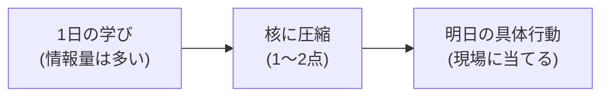
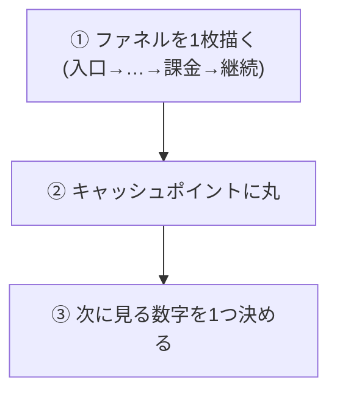

# ステップ7 持ち帰り

ここまでお疲れさまでした。

今日は朝から、サービスを読む → ファネルで詰まりを見つける → 施策を出す → 工数×インパクトで優先度をつける → 提案する、という流れを、実データで一周しました。

最後にやることは2つだけです。

1. 今日の核を、1〜2点に圧縮する
2. その核を、明日から自分の現場でどう使うか、具体行動に落とす

この2つは、こういう関係です。

図の見方：たくさん学んだことを、まず1〜2点に削り、それを明日の行動に変える。この順番が持ち帰りの型です。

ここを曖昧にしたまま帰ると、「楽しかった」で終わります。それだと、今日やったことが明日のあなたの仕事に1ミリも残りません。逆にここを締めれば、今日が「分かった日」ではなく「変わり始めた日」になります。

---

## まず、今日の核を1〜2点に圧縮する

合宿は1日かけて、いろいろなことをやりました。SQLも書いたし、通過率も出したし、提案までしました。情報量は多かったはずです。

ですが、全部を持ち帰ろうとすると、結局何も持ち帰れません。盛れば盛るほど、明日になると手が動かなくなる。

だから、ここでやることは逆です。今日学んだことを、自分の言葉で1〜2点まで削ります。

### 圧縮するとは、こういうこと

頭の中で、こう問いかけてみてください。

- 「今日いちばん、これは効くと思ったことは何か」
- 「それを一言で言うと、どうなるか」

たとえば今日の流れ全体を一言にするなら、こういう形になります。

- 「点で見ず、流れで見る。流れにしないと、どこを直せばいいか決められない」
- 「分析は出して終わりじゃない。行動を変えるために数字を出す」

どれが自分にとっての核かは、人によって違います。SQLでつまずいた人は「データは自分で取りに行ける」が核かもしれないし、提案で詰まった人は「数字 → 課題 → 施策の順で話す」が核かもしれません。

正解はありません。**あなた自身が、明日もう一度思い出せる一言**にできていれば、それで合格です。

### なぜ1〜2点なのか

人は、覚えた量で行動が変わるわけではありません。1つでも、本当に腹落ちした考え方があれば、それで行動は変わります。

逆に、10個ふんわり覚えても、明日には全部薄まって消えます。

だから盛らない。1〜2点に絞る。これが持ち帰りの最初のルールです。

---

## 次に、明日の具体行動に落とす

核を1〜2点に絞れたら、次はそれを「行動」にします。

ここがいちばん大事なところです。今日の合宿は、用意されたサービス（モック）でやりました。データもシードが入っていて、全員が同じスタートラインでした。

でも、明日からあなたが向き合うのは、自分の現場のサービスです。お客さんがいて、お金が動いていて、本物の数字があります。

今日やった描き方を、そのまま現場に当ててみる。これが持ち帰りワークです。

具体的には、次の3つだけやります。

図の見方：この3つを上から順にやるだけ。①で流れにして、②でお金の場所を見つけ、③で次に見る数字を1つに絞ります。

---

### ① 自分の現場のサービスで、ファネルを1枚書く

合宿のステップ2でやったことを、自分の担当サービスでもう一度やります。

- 入口（どうやってお客さんが入ってくるか）から
- 課金（どこでお金が発生するか）を通って
- 継続（その後どう続くか、あるいは離れるか）まで

これを、点ではなく1本の流れにつなぎます。

ここで大事なのは、**いきなり機能や改善案に飛ばないこと**です。今日も最初に釘を刺した通りで、いきなり「ここをこう直そう」と考えると、全体が見えていないので、直す場所を間違えます。

まずは流れを1枚にする。それだけ。段の数も区切り方も、自分で決めて構いません。今日描いたものと同じように、自分のサービスを各駅停車の電車のように並べてみてください。最初に何人乗って、どの駅で降りていくのか。その路線図を1枚描くイメージです。

### ② キャッシュポイントに丸をつける

1枚描けたら、その中で**売上や利益が発生している段に丸をつけます**。

これも今日やった通りです。キャッシュポイントは1つとは限りません。月額があるなら月額、手数料があるなら手数料、追加購入があるならそこも。お金が動いている場所には、全部丸をつけます。

丸をつけると、見え方が変わります。「自分が今やっている開発は、この丸につながっているのか?」が見えるようになる。丸につながっていない開発は、頑張っても売上には効きません。

ここまでやって、ようやくこう考えられるようになります。

**「この丸を伸ばすには、どの段の詰まりを直せばいいか」**

### ③ 次に見る数字を、1つだけ決めて帰る

最後です。ここがいちばん削れる人とそうでない人の差が出るところです。

ファネルを描いて、キャッシュポイントに丸をつけたら、**次に自分が見る数字を1つだけ決めます**。

たくさん決めなくていいです。むしろ、たくさん決めると、結局どれも見ません。

- どの段の人数が気になるか
- どの通過率を、まず1つ確かめたいか

これを1つだけ決める。そして、できれば明日それをSQLで出してみる。今日やったように、各段の人数を数えて、前の段で割って通過率にするだけです。

これが、合宿のいちばん大事な持ち帰りです。今日伝えたかったことを一言にすると、これに尽きます。

> 分析は、出して終わりじゃない。行動を変えるために数字を見る。

その第一歩が、「次に見る数字を1つ決めて帰る」ことです。1つ決めて、明日それを見る。それだけで、あなたは「言われたものを作るだけ」の場所から、確実に一歩抜けています。

---

## 最後に

今日できたことを、もう一度思い出してください。

サービスを読んで、ファネルを描いて、SQLで詰まりを名指して、施策を出して、優先度をつけて、提案までしました。これは、用意された環境とはいえ、GTMエンジニアが現場でやっていることの一周そのものです。

「分かった」を「できた」に変えた1日でした。

あとは、この一周を自分の現場に持ち込むだけです。完璧にやろうとしなくていい。まずはファネルを1枚描いて、丸をつけて、次に見る数字を1つ決める。そこから始めてください。

---

→ ワーク：ワークシートのステップ7（持ち帰り）をやる。自分の現場のサービスでファネルを1枚描き、キャッシュポイントに丸をつけ、次に見る数字を1つ決めて帰る。
