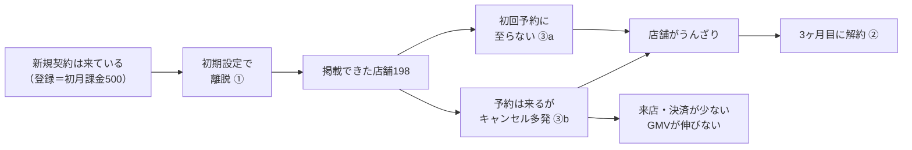
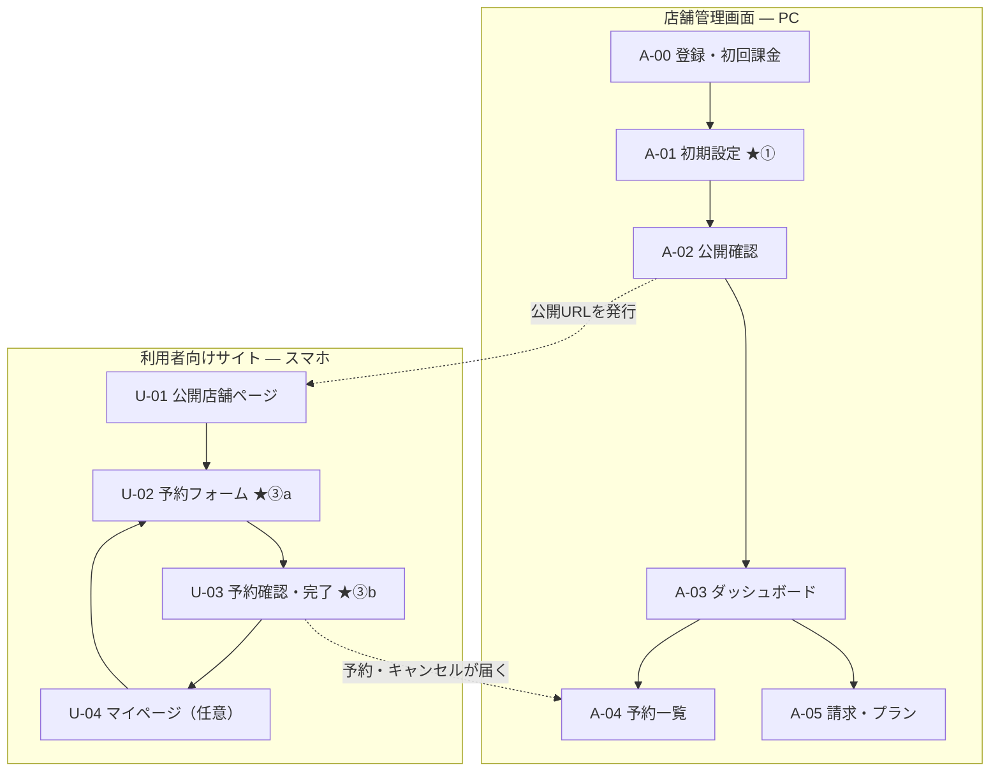
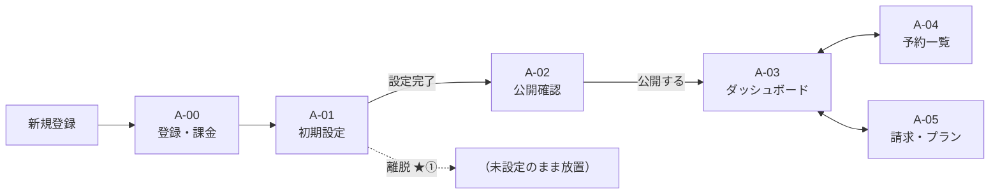
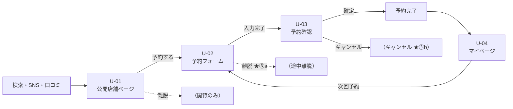
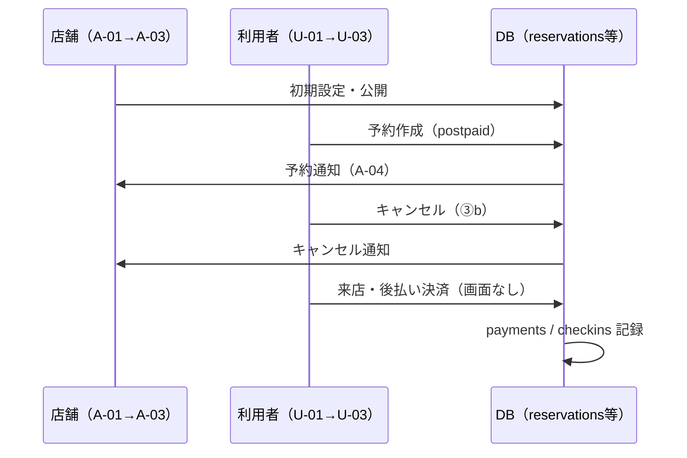
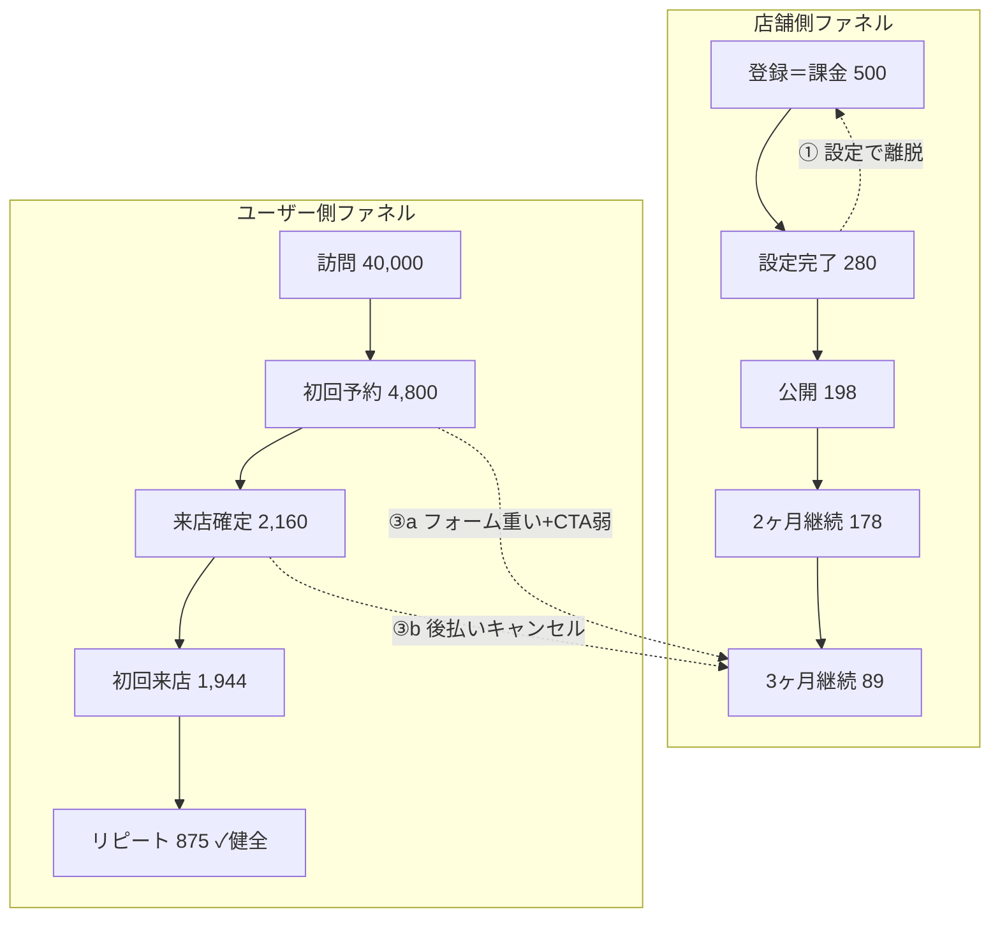
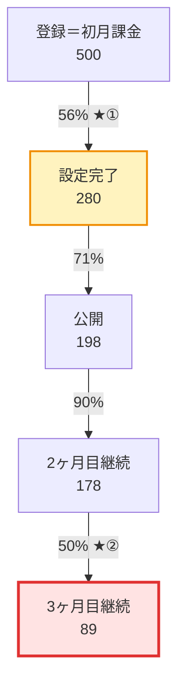
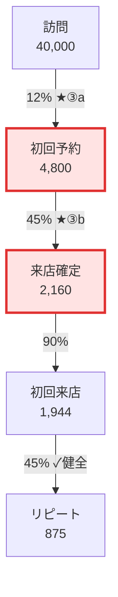
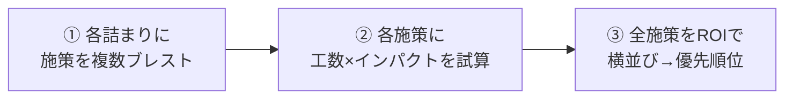

# ReServe合宿 設計書：仮想予約SaaSの詳細仕様・ビジネスモデル・ファネル・データモデル・ROIフレーム

これはシリーズ4冊の2冊目（設計）。1冊目の提案で決めた「何を・なぜ」を、当日そのまま運用できる粒度の仕様に落とす。数字・テーブル・単価・GMV・手数料はすべてこの設計書が正典であり、続くカリキュラム・コンテンツはこの値に完全一致させる。

## シミュレーションの土台：ReServe社の経営課題

ファネルの数字は、この経営課題を**データで診断させるためのシミュレーション**である。数字遊びではなく、以下の因果の鎖を受講生に発見させる。

### 状況

ReServeは美容室向け予約管理SaaS。**新規契約は来ている**（獲得はできている）。それでもReServe自身の売上（月額サブスク＋予約決済の1%手数料）が計画ほど伸びない。

### 正体＝「両側から漏れるバケツ」

| 漏れ | 側 | 症状 | 店舗・ReServeから見た影響 |
|---|---|---|---|
| ① オンボーディングの穴 | 店舗側 | 契約したのに**初期設定を完了できない** | 課金した店舗の半分近くが設定途中で離脱。公開以前に止まる |
| ② 早期チャーンの穴 | 店舗側 | 掲載できても**3ヶ月目に解約**する | MRRが積み上がらない |
| ③a 初回予約導線の穴 | ユーザー側 | 店舗ページを訪問しても**初回予約まで至らない** | 店舗から見ると「そもそも予約が入らない」 |
| ③b キャンセルの穴 | ユーザー側 | 予約は入るが**キャンセル率が異常に高い** | 店舗ダッシュボードがキャンセルだらけでうんざり |

### 因果の鎖（これが答え）



- **②の根本原因は③a＋③b** — 店舗が3ヶ月目に続けない理由は、**予約が実質つながっていない**から。初回予約自体が少ないうえ、入った予約もキャンセルばかりで、店舗は「ReServe使っても予約が回らない」と感じて解約する。
- **③aの正体** — 初回予約フォームの**入力項目が多すぎる**うえ、**送信CTAがボタンに見えない**（ただのテキストリンク風）。店舗ページには訪問するが、予約完了まで至らない。
- **③bの正体** — ReServeは**後払い**（予約時点では決済なし、来店時に支払い）。金銭的コミットがないため、**キャンセル率が異常に高い**（確定率45%＝キャンセル率55%）。店舗には「予約が入った」と見えても、当日キャンセルが続出する。
- **リピートは健全** — 一度来店した客のリピート率（45%）は業界標準どおり。**問題は初回の獲得とキャンセル**にある。
- **①は別レイヤー** — そもそも初期設定を完了できない店舗は、公開以前にサブスクの価値を得られない。管理画面のオンボーディングUI/UXがわかりづらく、**登録→設定完了**の段で離脱が集中している。

ミッション＝これをデータで診断し、**各詰まりに複数の打ち手を出し、工数とインパクトで横並び比較して、全体として何を先にやるかを決める**。

## 仮想SaaS「ReServe」詳細仕様

- **何をするサービスか** — ReServe（リザーブ）は、美容室（ヘアサロン）向けの**予約管理SaaS（架空）**。美容室はReServeで予約枠を作って公開し、利用者はその枠を予約し、**来店時に施術料金をReServe経由で都度決済する（後払い）**。
- **誰が使うか** — 二者。
  - **店舗（供給側）**：管理画面でメニュー・予約枠を登録し、店舗ページを公開する。**登録と同時に初月課金**（無料トライアルなし）。
  - **利用者（需要側）**：公開店舗ページから予約する。決済は**来店時（後払い）**。
- **後払いモデル（重要）** — 予約確定時点では決済しない。来店時に `payments` が発生する。これが③b（高キャンセル）の構造的原因。
- **扱わないもの** — 物販EC、マッチング。月額会員・回数券も使わない。

## サイトマップ

ReServeは**2つのWeb**に分かれる。店舗はPC向け管理画面、利用者はスマホ向け予約サイト。ログイン・会員登録画面は**作らない**（利用者は店舗ページから直接予約する）。

### 全体構成



| 記号 | 意味 |
|---|---|
| ★①②③a③b | ファネル上の詰まりが発生する画面 |
| 実線矢印 | 通常の画面遷移 |
| 点線矢印 | データ・通知の連携（画面遷移ではない） |

### 店舗管理画面（供給側）

#### 導線



| ID | ページ名 | 遷移元 | 遷移先 | ファネル段 | モック |
|---|---|---|---|---|---|
| A-00 | 登録・初回課金 | 外部LP | A-01 | 登録＝課金500 | 不要（1画面で済ませる） |
| A-01 | 初期設定（オンボーディング） | A-00 | A-02／離脱 | **設定完了280 ★①** | **必須** |
| A-02 | 公開確認 | A-01 | A-03 | 公開198 | 任意（A-01に統合可） |
| A-03 | ダッシュボード | A-02、サイドナビ | A-04、A-05 | ②の文脈（体感のみ） | **必須** |
| A-04 | 予約一覧 | A-03 | A-03 | 同上（A-03に統合可） | A-03に統合可 |
| A-05 | 請求・プラン | A-03 | A-03 | 継続・解約 | 不要 |

#### 各ページの画面項目

**A-00 登録・初回課金**

| 項目 | 内容 |
|---|---|
| 店舗名 | テキスト入力 |
| 担当者名・メール | テキスト入力 |
| プラン表示 | 月額12,000円／即課金（トライアルなし） |
| CTA | 「登録して始める」→ 課金完了後 A-01 へ |

**A-01 初期設定（オンボーディング）★①**

| 項目 | 入力種別 | 必須 | 備考 |
|---|---|---|---|
| 店舗名 | テキスト | ○ | 登録時と重複。混乱の元 |
| 店舗写真 | 画像アップロード | ○ | |
| 住所・電話 | テキスト | ○ | |
| 営業時間 | 曜日×時間の表 | ○ | 7行。スクロールが必要 |
| メニュー名 | テキスト | ○ | 複数行追加可 |
| メニュー料金 | 数値 | ○ | メニューごと |
| スタイリスト名 | テキスト | ○ | 複数人追加可 |
| 定休日 | チェックボックス | ○ | |
| 進捗表示 | — | — | **なし**（①の根本原因） |
| CTA | ボタン | — | 「次へ」が何ステップ目か不明。「設定を完了」までの道筋が見えない |

> **①の詰まり** — 項目が多く、順序がわからない。500店舗中220店舗がここで離脱。

**A-02 公開確認**

| 項目 | 内容 |
|---|---|
| 設定内容プレビュー | A-01で入力した内容の一覧 |
| 公開URLプレビュー | `reserve.example/s/田中美容室` |
| CTA | 「公開する」→ A-03 へ／「戻って編集」→ A-01 |

**A-03 ダッシュボード**（②の文脈・体感用。**数値の判断はここではしない**）

| 項目 | 内容 |
|---|---|
| サマリーカード | 今月の予約数／キャンセル数／来店数（**サンプル仮数字**） |
| 直近の予約一覧 | 日時・メニュー・ステータス（確定／キャンセル／来店済） |
| キャンセル通知 | 「本日3件キャンセルされました」など**UIとして目立つ表示** |
| サイドナビ | ダッシュボード／予約一覧／請求・プラン |
| 継続ステータス | 契約○ヶ月目（任意） |

**モックに載せる数字の例（仮・正典ではない）**

| 表示項目 | サンプル値 | 用途 |
|---|---|---|
| 今月の予約 | 42件 | 見た目のサンプル |
| キャンセル | 18件 | **キャンセルが目立つレイアウト**を見せるため |
| 来店済 | 12件 | 同上 |
| 通知 | 「本日3件キャンセル」 | 店舗オーナーの**うんざり感**の演出 |

> **ここで判断してはいけないこと** — 「キャンセルが多い＝③bが詰まり」などの**定量判断**。モックの18件はDBの2,640件や通過率45%と**無関係な仮数字**。③bの特定は `reservations` の `status` をSQLで数える（コマ2〜3）。
>
> **モックで伝えること** — 店舗オーナーが**どんな画面を見て、どんな通知が来るか**（ qualitative ）。「後払いだからキャンセルが軽い」という**構造**は U-03 で見せ、**何%詰まっているか**はDBで見せる。

**A-04 予約一覧**（A-03と統合してもよい）

| 項目 | 内容 |
|---|---|
| フィルタ | 確定／キャンセル／来店済／すべて |
| 一覧行 | 予約日時・メニュー・利用者名（仮名可）・ステータス |
| 件数表示 | 例：確定12件／キャンセル18件 — **レイアウト用サンプル。分析に使わない** |

**A-05 請求・プラン**

| 項目 | 内容 |
|---|---|
| 現在プラン | 月額12,000円 |
| 課金履歴 | 初月〜の請求日一覧（`billing_periods` に対応） |
| 解約ボタン | 3ヶ月目チャーンの文脈用（モック不要） |

---

### 利用者向けサイト（需要側）

#### 導線



| ID | ページ名 | 遷移元 | 遷移先 | ファネル段 | モック |
|---|---|---|---|---|---|
| U-01 | 公開店舗ページ | 外部流入 | U-02 | 訪問40,000 | **必須** |
| U-02 | 予約フォーム | U-01 | U-03／離脱 | **初回予約4,800 ★③a** | **必須** |
| U-03 | 予約確認・完了 | U-02 | 完了／キャンセル | **来店確定2,160 ★③b** | **必須** |
| U-04 | マイページ | U-03、ブックマーク | U-02 | リピート875（健全） | 任意 |

> **会員登録・ログインは挟まない** — U-01からU-02へ直接遷移。訪問40,000のうち4,800が予約完了（12%）。

#### 各ページの画面項目

**U-01 公開店舗ページ**

| 項目 | 内容 |
|---|---|
| 店舗名・写真 | A-01で登録された内容の表示 |
| 住所・アクセス | 地図リンク（任意） |
| 営業時間・定休日 | テキスト表示 |
| メニュー一覧 | メニュー名・料金・所要時間 |
| スタイリスト一覧 | 名前・写真（任意） |
| CTA | **「予約する」** ボタン（固定フッター推奨）→ U-02 |

**U-02 予約フォーム ★③a**

| 項目 | 入力種別 | 必須 | 備考 |
|---|---|---|---|
| メニュー選択 | ラジオ or プルダウン | ○ | |
| 日付選択 | カレンダー | ○ | |
| 時間帯選択 | プルダウン | ○ | |
| スタイリスト指名 | プルダウン | ○ | 「指名なし」なし＝強制 |
| お名前 | テキスト | ○ | |
| 電話番号 | テキスト | ○ | |
| 要望・備考 | テキストエリア | ○ | 空欄不可 |
| アンケート | チェック複数 | ○ | 「来店動機」「髪の悩み」等 |
| CTA（送信） | **テキストリンク風** | — | **③aのUX問題**。下線付き青文字「予約内容を確認する」程度。ボタン形状・背景色・固定フッターなし。押せるのか分からない |

> **③aの詰まり（モックで伝えること）** — ①入力項目が多くスクロールが長い、②**送信CTAがボタンに見えない**（テキスト風で目立たない）。**訪問→予約12%という数字はSQLで出す** — モックから率は読まない。

**U-03 予約確認・完了 ★③b**

| 項目 | 内容 |
|---|---|
| 予約内容サマリー | メニュー・日時・店舗名 |
| 支払い案内 | **「予約時のお支払いは不要です。来店時に施術料金をお支払いください」** |
| 金額目安 | ○○円（税込）— 参考表示のみ。ここでは決済しない |
| CTA（確定） | 「予約を確定する」→ 予約完了画面 |
| CTA（キャンセル） | **「キャンセル」** — 目立つ配置。金銭コミットなし |

予約完了後：

| 項目 | 内容 |
|---|---|
| 完了メッセージ | 「予約が完了しました」 |
| 予約番号 | 表示のみ |
| 再来店導線 | 「マイページで確認」→ U-04（任意） |

> **③bの構造（モックで伝えること）** — 予約時に課金がないため、利用者は気軽にキャンセルできる。**キャンセル率55%という数字はモックからは読めない** — `reservations` をSQLで数える。

**U-04 マイページ（任意・リピート健全）**

| 項目 | 内容 |
|---|---|
| 次回予約 | 「次の予約を取る」ボタン → U-02 |
| 予約履歴 | 過去の来店一覧（簡易） |

> リピート率45%は標準。ここは薄いモックで十分。

---

### 二面の接続（データの流れ）

| 店舗側 | 利用者側 | 連携 |
|---|---|---|
| A-02 公開 | U-01 店舗ページ | 公開URLで接続 |
| A-04 予約一覧 | U-03 予約確定／キャンセル | 予約・キャンセルがリアルタイム反映 |
| A-05 請求 | — | 店舗サブスクのみ。利用者課金なし |
| — | 来店時決済（画面外） | `payments` / `checkins` が発生。GMVの源泉 |



### ページ数サマリー

| 面 | ページ数 | モック必須 | ファネル詰まり |
|---|---|---|---|
| 店舗管理画面 | 6（A-00〜A-05） | 2（A-01、A-03） | ① A-01（UX）。②はSQLで特定、A-03は文脈のみ |
| 利用者サイト | 4（U-01〜U-04） | 3（U-01、U-02、U-03） | ③a U-02、③b U-03 |
| 講師用 | 1 | 1 | — |
| **合計** | **11** | **6必須＋1任意** | 4箇所 |

## UIモック設計

ページ構成・導線・画面項目の正典は上の**サイトマップ**。ここでは、当日モックとして**何を作るか**に絞る。

### 作る原則（4つ）

1. **詰まり1つ＝画面1つ** — ①③a③bそれぞれに、根本原因がわかる画面を1枚ずつ（**UX・構造の理解**）
2. **動かなくていい** — Figma・静止HTML・スクショで十分
3. **作りすぎない** — リピート導線やログインなど、健全／省略した段は薄くてよい
4. **数字で診断しない** — モックの件数は**サンプル仮数字**。詰まりの特定・通過率・ROIは**すべてSQL**（後述）

### モックとSQLの役割分担（重要）

| | UIモック | SQL（シードDB） |
|---|---|---|
| **目的** | 店舗・利用者が**何に困るか**を体感 | ReServeの売上課題を**数字で証明** |
| **わかること** | フォームが長い、**送信CTAがテキスト風**、後払い表示、通知がうるさい | 通過率12%、キャンセル2,640件、継続89店舗 |
| **コマ** | 主にコマ1（オリエン）＋コマ4（施策の議論） | コマ2〜3（ファネル分析）＋コマ5（ROI） |
| **NG** | 「ダッシュボード見たらキャンセル多いから③b」 | — |
| **OK** | 「こういう通知が来ると店舗はうんざりするよね」→ SQLで実際の率を確認 | `COUNT(*) WHERE status='cancelled'` で③bを特定 |

> **ダッシュボード（A-03）の数字は演出用** — キャンセル18件などはレイアウト用の仮数。正典は `reservations` テーブル。受講生がモックの数字から詰まりを答えたら**不合格扱いに近い**（講師FBでSQLに戻す）。

### 作るべきモック（最小5画面）

| 優先 | 画面ID | 画面 | 詰まり | 受講生に見せたいこと | 必須で入れる要素 |
|---|---|---|---|---|---|
| **必須** | A-01 | 店舗オンボーディング | ① | 「どこから手をつければいいかわからない」 | サイトマップ A-01 の全項目。進捗なし |
| **必須** | A-03 | 店舗ダッシュボード | ②文脈 | 店舗が**どんな通知・一覧を見るか**（うんざりの演出） | サマリー・通知UI。**数字は仮。判断はSQL** |
| **必須** | U-02 | 利用者・初回予約フォーム | ③a | 項目が多い＋**CTAがテキスト風で弱い** | 全必須項目＋送信は**ボタンに見えない**テキスト表示 |
| **必須** | U-03 | 利用者・予約確認 | ③b | 「金を払ってないから気軽にキャンセルできる」 | 後払い案内＋目立つキャンセルボタン |
| **必須** | U-01 | 公開店舗ページ（入口） | ③a（文脈） | 訪問→予約の入口 | サイトマップ U-01。「予約する」→ U-02 |
| 任意 | U-04 | マイページ・次回予約 | リピート（健全） | 「ここは壊れていない」対照用 | 次回予約ボタンのみ |
| 講師用 | — | ReServe収益サマリー | 模範解 | コマ7の答え合わせ | サブスク1,068,000＋手数料182,760＝1,250,760、GMV18,276,000 |

> **会員登録画面は作らない** — ファネル上、③aは「訪問→初回予約」に簡略化している。ログイン・会員登録のモックは不要。

### 作らなくていいもの

| 作らない | 理由 |
|---|---|
| ログイン／会員登録フロー | ③aの詰まりは訪問後の予約フォーム。登録段は設計から外している |
| 決済・カード入力画面 | 後払いモデル。GMVは来店時に発生し、モックでは「支払い不要」の表示だけで③bが伝わる |
| 管理画面の全設定ページ | ①は「初期設定がわかりづらい」1画面で足りる。公開設定・枠管理の別画面は不要 |
| 施策改善後の「良い版」モック | 当日は現状の悪いUXだけ見せる。改善案はブレストとROIで言語化する |
| スマホアプリ全体 | Webの主要導線だけで十分 |

### チーム別に触らせる画面

| チーム | コマ1で重点的に見せるモック |
|---|---|
| 管理画面側 | オンボーディング（①のUX）＋ ダッシュボード（②の**画面イメージ**のみ） |
| ユーザー側 | 店舗ページ（入口）＋ 予約フォーム（③a）＋ 予約確認（③b） |

両チームとも、相手側のモックは**5分で俯瞰**する。二面の因果（③が②を起こす）を理解するため。

### 制作の粒度（これで十分）

- **解像度** — スマホ幅1画面＋PC管理画面1画面。レスポンシブ対応不要
- **データ** — 実DB接続不要。**数字はサンプル仮置き**（例：キャンセル18件）。正典の2,640件等とは一致させない
- **ブランド** — ReServeロゴ＋美容室っぽい配色があれば十分。デザインの完成度は問わない
- **納品形式** — Figmaリンク、または `合宿/mock/` 配下の静的HTML。当日はプロジェクター or 受講生のブラウザで開く

### 当日の使い方

| コマ | モックの役割 |
|---|---|
| コマ1（オリエン） | **触って**二面構造とキャッシュポイント2つを掴む。UXの体感のみ。**詰まりの数字は言わない** |
| コマ2〜3（SQL） | **主役はDB。** ここで初めて③b（45%）等を自分の手で出す |
| コマ4（ブレスト） | 根本原因の議論で**該当画面を再表示**。「この画面のどこを直すか」を施策に結びつける |
| コマ7（講評） | 講師用収益サマリーで数字の答え合わせ |

### 主要画面一覧（制作チケット用）

サイトマップのページIDと対応。

| 画面ID | 画面 | 担当面 | 目的 |
|---|---|---|---|
| A-01 | 店舗オンボーディング画面 | 管理画面側 | ①の根本原因 |
| A-03 | 店舗管理ダッシュボード | 管理画面側 | ②の**画面イメージ**（数値判断はSQL） |
| U-01 | 公開店舗ページ | ユーザー側 | ③aの入口 |
| U-02 | 利用者向け初回予約フォーム | ユーザー側 | ③a：項目多い＋**CTAがテキスト風** |
| U-03 | 予約確認画面（後払い表示） | ユーザー側 | ③bの根本原因 |
| U-04 | マイページ・次回予約（任意） | ユーザー側 | リピートは健全。対照用 |
| — | ReServe収益サマリー（講師用） | 模範解側 | コマ7開示用 |

## ビジネスモデル：2つのキャッシュポイントと単価

| キャッシュポイント | 収益タイプ | 単価 | 母数 | 当日の特定方法 |
|---|---|---|---|---|
| ① 店舗サブスク | 固定収益 | 12,000円/月 | **3ヶ月目継続89店舗** | `DISTINCT amount FROM billing_periods` → 12,000。`COUNT(DISTINCT store_id) FROM billing_periods WHERE period_month=3 AND status='paid'` → 89。 |
| ② 予約都度決済GMVの1% | 変動収益 | 平均4,000円/件 × 1% | GMV＝**18,276,000円**（決済4,569件） | `AVG`/`SUM` on `payments`。来店時の後払い決済がGMVの源泉。 |

### 課金モデル（店舗・即課金）

- 登録＝初月課金500。トライアルなし。減るのは継続段のみ。

### 模範解（講師用）

- **手数料率**：1%
- **平均決済単価**：4,000円
- **月間GMV**：18,276,000円（＝4,569件 × 4,000円）
- **月間手数料収益**：182,760円
- **月間サブスク収益**：1,068,000円（89 × 12,000円）
- **月間ReServe収益合計**：1,250,760円
- **決済内訳**：初回来店決済1,944件 ＋ リピーター875人×3回＝2,625件 ＝ 合計4,569件

## 二面構造とチームの担当領域

| チーム | ミッション | リターン式 |
|---|---|---|
| 管理画面側 | オンボーディング離脱防止と3ヶ月目継続改善。店舗の「うんざり」を減らす。 | （増えた継続店舗数）× 12,000円 × 12ヶ月 |
| ユーザー側 | 初回予約率の改善（③a）とキャンセル率低減（③b）で、店舗に実質的な来店・決済を届ける。 | （増えたGMV）× 1% × 12ヶ月 |

## ファネル定義

以下の数字はすべて、このストーリーを**データで再現したもの**。受講生にはまず物語を掴ませ、次にSQLで各段を自分の手で出させる。

### ストーリー：美容室オーナー・田中さんの3ヶ月

ReServeのデータに登場する架空店舗のうち、**店舗ID 150（公開済み・2ヶ月目まで継続・3ヶ月目に解約）** と、そこに来店しそうだった利用者の動きを軸に読む。

---

#### 第1幕：獲得はできている（店舗側・登録500）

ReServe社の営業は順調だ。美容室は「予約管理、スマホでできて便利そう」と思い、**毎月500店舗が新規登録する**。無料トライアルはない。登録した瞬間に初月12,000円が引かれる。ここまでは数字が減らない。**「契約は来ている」**のは本当だ。

#### 第2幕：払ったのに設定が終わらない（店舗側・①オンボーディング）

田中さんもその一人。初月分を払い、管理画面を開いた。**店名・メニュー・料金・営業時間・スタイリスト**——入力すべき項目が多く、どこから手をつければいいかわからない。ステップの進み方も直感的でなく、**「とりあえず後でやろう」**のまま画面を閉じる店舗が続出する。

500店舗のうち、初期設定を完了できたのは**280店舗（56%）**だけ。業界標準の80%を大きく下回る。**①の詰まりはここ**——登録はできても、設定完了まで辿り着けない。

設定を完了した280店舗のうち、店舗ページを公開できたのは**198店舗（71%）**。公開までの通過率自体は悪くない。問題は、その手前で**220店舗が初期設定の途中で止まっている**ことだ。

#### 第3幕：表に出ても、予約が来ない（ユーザー側・③a）

田中さんの店舗ページには、月に**40,000人**が訪れる。メニューも写真も載っている。しかし**初回予約フォーム**が重い——メニュー選択、日時、担当者、要望欄、アンケート……入力項目が多すぎる。さらに最後の「予約内容を確認する」が**ボタンではなく、ただのテキストリンクのように見える**。押すべきかどうかわからず、そのまま離脱する人も多い。

40,000人のうち、初回予約を完了するのは**4,800人（12%）**だけ。業界標準の25%を大きく下回る。**③aの詰まりはここ**——店舗ページには来るが、予約に至らない。

田中さんのダッシュボードを見ると、**そもそも予約件数が少ない**。「ReServe入れたのに客が来ない」と感じ始める。

#### 第4幕：予約が入ってもキャンセルだらけ（ユーザー側・③b）

それでも4,800件の初回予約は入る。しかしReServeは**後払い**——予約時点では決済しない。「来店時にお支払いください」と表示されるだけなので、利用者に金銭的コミットがない。

結果、**予約の55%がキャンセル**される。4,800件のうち、来店確定するのは**2,160件（45%）**だけ。田中さんの画面には「明日の予約」と表示されていたのに、当日キャンセル通知が続々と届く。

> 田中さんの体感：「予約に繋がらない（③a）」＋「繋がってもキャンセル（③b）」のダブルパンチ。

#### 第5幕：来店した客はちゃんと戻ってくる（ユーザー側・リピートは健全）

一方で、**一度来店した客のリピート率は45%**——業界標準どおり。来店確定2,160人のうち875人が2回目以降も来る。リピート導線自体は壊れていない。

問題の本丸は**初回の獲得（③a）とキャンセル（③b）**にある。リピートを改善しても、そもそも来店が少なければ店舗の満足度は上がらない。

#### 第6幕：3ヶ月目、田中さんは解約する（店舗側・②早期チャーン）

公開できた198店舗のうち、2ヶ月目まで課金を続けたのは178店舗（90%）。田中さんもここまでは残った。「もう少し様子を見よう」と思った。

しかし3ヶ月目になると、**半分が解約**する。178店舗のうち、3ヶ月目も課金を続けるのは**89店舗（50%）**だけ。田中さんもその一人だ。

解約理由をアンケートで聞くと、答えはほぼ一つ。**「予約が実質回らない。月1万2千円払う価値がない」**。獲得やリピートの問題ではなく、**初回予約が少ない × キャンセルが多い**というユーザー側の穴が、店舗の解約に直結している。

---

#### 二面をつなぐ因果（このストーリーの結論）



| 誰の視点 | 何が起きているか | データ上の詰まり |
|---|---|---|
| ReServe社 | 獲得500は順調だがMRRが積み上がらない | 3ヶ月継続89（②） |
| 田中さん（店舗） | 掲載したが予約が回らずうんざり | SQL：`reservations` の確定率・キャンセル件数 |
| 利用者 | フォームが面倒・CTAが押しづらい／後払いで気軽にキャンセル | ③a 12%（SQL）、③b 45%（SQL） |
| 受講生の仕事 | この因果をSQLで証明し、どこに投資するかROIで決める | 下のファネル表 |

> **当日伏せる正解** — ①設定完了56%、②3ヶ月目50%、③a訪問→初回予約12%、③b来店確定45%。リピート45%は**問題ではない**。受講生に数字で言わせる。

---

### 管理画面側チーム（店舗オンボーディング＆継続）

| 段 | 件数 | 前段からの通過率 | 内容 |
|---|---|---|---|
| 登録＝初月課金 | 500 | — | 登録と同時に初月課金。 |
| 設定完了 | 280 | **56%** | `is_setup_done=true`。**【副次① オンボーディング】** 通常80%相当。初期設定のUI/UXがわかりづらく、ここで離脱が集中。 |
| 公開（掲載） | 198 | 71% | `is_published=true`。設定完了した店舗のうち71%が公開まで到達（ここは健全）。 |
| 2ヶ月目継続 | 178 | 90% | `billing_periods` で `period_month=2` かつ `paid` の店舗数。公開198のうち90%。 |
| 3ヶ月目継続 | 89 | **50%** | `billing_periods` で `period_month=3` かつ `paid` の店舗数。**【中核②】** 2ヶ月目178のうち50%。 |



### ユーザー側チーム（予約導線＝GMV）

| 段 | 件数 | 前段からの通過率 | 内容 |
|---|---|---|---|
| 訪問 | 40,000 | — | 公開店舗ページへの訪問（定数。テーブルなし）。 |
| 初回予約 | 4,800 | **12%** | `reservations` の初回予約件数。**【中核③a】** 通常25%相当。入力項目が多い＋**送信CTAが弱い（テキスト風）**。 |
| 来店確定（キャンセルなし） | 2,160 | **45%** | `status='confirmed'` の予約。**【中核③b】** 通常80%相当（キャンセル率55%）。**後払い**のためキャンセルしやすい。 |
| 初回来店 | 1,944 | 90% | `checkins` で来店し、後払い決済。 |
| リピート | 875 | **45%** | 2回目以降の来店決済。**健全（課題ではない）**。 |

> **リピートは意図的に標準値** — 初回来店1,944の45%＝875。ここは伸ばすべき副次課題であり、店舗解約の主因ではない。主因は③a（訪問から予約に至らない）と③b（キャンセル多発）。



### 仕込んだ詰まりと因果（当日伏せる正解）

| 区分 | 場所 | 観測値 | 通常値 | 根本原因 | 見つけ方 |
|---|---|---|---|---|---|
| ① 副次 | 管理：登録→設定完了 | 56% | 80% | **初期設定のUI/UXがわかりづらい**（入力項目・ステップが迷子） | `is_setup_done` 280 ÷ 登録500 |
| ② 中核 | 管理：2ヶ月→3ヶ月継続 | 50% | 85% | 予約が実質回らず店舗がうんざり | `period_month=3` の店舗89 ÷ `period_month=2` の店舗178 |
| ③a 中核 | ユーザー：訪問→初回予約 | 12% | 25% | **フォームが重い＋送信CTAがボタンに見えない** | 初回予約4,800 ÷ 訪問40,000（定数） |
| ③b 中核 | ユーザー：初回予約→来店確定 | 45% | 80% | **後払いでキャンセルしやすい**（金銭コミットなし） | `confirmed` 2,160 ÷ 初回予約4,800。`cancelled` 2,640件 |

**店舗が見ている世界（ストーリー用）** — データ上、初回予約4,800件のうち2,640件がキャンセル。店舗の画面にはキャンセル通知が届き続ける（**この件数はSQLで出す。モックの18件とは無関係**）。実質来店は1,944件。「予約に繋がらない（③a）」＋「繋がってもキャンセル（③b）」のダブルパンチでうんざり→3ヶ月目解約（②）。

## データモデル

### stores（500行）— オンボーディング段のみ

| カラム | 型 | 説明 |
|---|---|---|
| is_setup_done | boolean | seq≤280（設定完了） |
| is_published | boolean | seq≤198（公開） |

> **継続は `stores` では見ない。** 2ヶ月目・3ヶ月目の継続はすべて `billing_periods` から数える。オンボーディング段（設定・公開）は `stores`、課金継続は `billing_periods` と役割を分ける。

### billing_periods（767行）— 月次課金の履歴（継続の正典）

**1店舗につき最大3行**（何ヶ月目の課金かが行として残る）。`status='active'` だけの1行設計では継続月数も2→3ヶ月の通過率もSQLで出せないため、**月ごとに1行**にする。

| カラム | 型 | 説明 |
|---|---|---|
| id | int | 主キー |
| store_id | int | stores.id 外部キー |
| period_month | int | **何ヶ月目の課金か**（1＝初月、2＝2ヶ月目、3＝3ヶ月目） |
| amount | int | 12,000（全行同一。`DISTINCT` で単価特定） |
| billed_at | timestamptz | その月の課金日（JST固定。`started_at` から30日ごと） |
| status | text | `paid`（課金成功）／ `failed`（未払い・解約） |

**行数の内訳**

| period_month | 行数 | 意味 |
|---|---|---|
| 1 | 500 | 登録＝初月課金。全店舗が1ヶ月目を `paid` |
| 2 | 178 | 2ヶ月目も `paid` した店舗（公開198のうち90%） |
| 3 | 89 | 3ヶ月目も `paid` した店舗（2ヶ月目178のうち50%） |
| 合計 | **767** | — |

**seqでの切り方（シード）**

- `period_month=1`：`store_id` 1..500 すべて `paid`
- `period_month=2`：`store_id` 1..178 のみ `paid`（179..500は2ヶ月目行なし＝既に解約）
- `period_month=3`：`store_id` 1..89 のみ `paid`
- 例：`store_id=150` は1・2ヶ月目のみ `paid`（公開済みだが3ヶ月目に解約）。`store_id=300` は1ヶ月目のみ。

#### 継続をSQLで出す（ワークの模範クエリ）

```sql
-- 登録＝初月課金（500）
SELECT COUNT(DISTINCT store_id) FROM billing_periods
WHERE period_month = 1 AND status = 'paid';

-- 2ヶ月目継続（178）
SELECT COUNT(DISTINCT store_id) FROM billing_periods
WHERE period_month = 2 AND status = 'paid';

-- 3ヶ月目継続（89）＝当月MRRの母数
SELECT COUNT(DISTINCT store_id) FROM billing_periods
WHERE period_month = 3 AND status = 'paid';

-- 2ヶ月目→3ヶ月目の通過率（50%）
SELECT
  (SELECT COUNT(DISTINCT store_id) FROM billing_periods
   WHERE period_month = 3 AND status = 'paid')::float
  / (SELECT COUNT(DISTINCT store_id) FROM billing_periods
     WHERE period_month = 2 AND status = 'paid');

-- 店舗ごとの継続月数（何ヶ月分支払ったか）
SELECT store_id,
       COUNT(*) FILTER (WHERE status = 'paid') AS months_paid,
       MIN(billed_at) AS first_billed_at,
       MAX(billed_at) FILTER (WHERE status = 'paid') AS last_billed_at
FROM billing_periods
GROUP BY store_id
ORDER BY store_id;

-- 継続日数（最終課金日 − 初回課金日）。スナップショット日はシードで固定
SELECT store_id,
       MAX(billed_at) - MIN(billed_at) AS subscription_span
FROM billing_periods
WHERE status = 'paid'
GROUP BY store_id;

-- 当月サブスク収益（3ヶ月目継続89 × 12,000）
SELECT COUNT(DISTINCT store_id) * (SELECT DISTINCT amount FROM billing_periods)
FROM billing_periods
WHERE period_month = 3 AND status = 'paid';
-- → 1,068,000
```

> **なぜ `billing` 1行＋`active`/`churned` だけではダメか** — 現状スナップショットしか持たず、「2ヶ月目はいたが3ヶ月目に落ちた」が区別できない。`period_month` 列があると、ファネルの各段を**同じテーブルから** `COUNT` で再現でき、継続日数も `billed_at` の差分で出せる。

### reservations（7,425行）

| カラム | 型 | 説明 |
|---|---|---|
| status | text | `confirmed`＝2,160（初回）＋2,625（リピート）＝4,785。`cancelled`＝2,640（③b）。 |
| payment_timing | text | 全行 `postpaid`（後払い）。 |

- 初回予約4,800行：うち2,160 `confirmed`、2,640 `cancelled`
- リピート予約2,625行：全て `confirmed`
- 合計7,425行

### payments（4,569行・来店時後払い）

| カラム | 型 | 説明 |
|---|---|---|
| amount | int | AVG=4,000、SUM=18,276,000 |

初回1,944 ＋ リピート875人×3回2,625 ＝ 4,569。

### checkins（4,569行）

来店＝決済（後払い）。`payments` と1:1対応。

## シードデータ設計方針

- 管理側：500→280→198→178→89
- ユーザー側：40,000→4,800→2,160→1,944→875（リピート健全）
- `billing_periods`：month1は store_id 1..500、month2は 1..178、month3は 1..89。各 `(store_id, period_month)` はユニーク。
- `users`：4,800行（初回予約を完了した利用者。ファネル段ではなく予約のFK用）
- `reservations`：初回4,800 ＋ リピート2,625
- `payments`/`checkins`：来店決済4,569行
- 訪問40,000は定数

### シード検算クエリ（講師用）

```sql
SELECT
  (SELECT COUNT(*) FROM stores)                                          AS registered_500,
  (SELECT COUNT(*) FROM stores WHERE is_setup_done)                      AS setup_done_280,
  (SELECT COUNT(*) FROM stores WHERE is_published)                       AS published_198,
  (SELECT COUNT(DISTINCT store_id) FROM billing_periods
   WHERE period_month=2 AND status='paid')                               AS month2_178,
  (SELECT COUNT(DISTINCT store_id) FROM billing_periods
   WHERE period_month=3 AND status='paid')                               AS month3_89,
  (SELECT COUNT(DISTINCT user_id) FROM reservations
   WHERE user_id <= 4800)                                                AS first_booking_4800,
  (SELECT COUNT(*) FROM reservations WHERE status='confirmed')           AS confirmed_4785,
  (SELECT COUNT(*) FROM reservations WHERE status='cancelled')           AS cancelled_2640,
  (SELECT COUNT(*) FROM checkins)                                        AS visits_4569,
  (SELECT COUNT(*) FROM (
    SELECT user_id FROM payments GROUP BY user_id HAVING COUNT(*)>=2) r)  AS repeaters_875,
  (SELECT SUM(amount) FROM payments)                                     AS gmv_18276000,
  (SELECT ROUND(SUM(amount)*0.01) FROM payments)                         AS fee_182760;
```

期待値：500 / 280 / 198 / 178 / 89 / 4800 / 4785 / 2640 / 4569 / 875 / 18276000 / 182760。

## 投資対効果フレーム

当日のワークは **「詰まり1つ＝施策1つ」ではない**。各詰まりに対して解決策を**複数**出し、それぞれに工数とインパクトを見積もり、**全施策を同じ土俵（ROI）で横並びにして**、全体として何を先にやるかを決める。

### 当日の進め方（3ステップ）



| ステップ | やること | この段階でやらないこと |
|---|---|---|
| 1. ブレスト | 詰まり①②③a③bごとに、根本原因を1文にし、打ち手を**最低5案**（チーム合計10案以上） | 1案に絞る／良し悪しを決める |
| 2. 試算 | 主要案に**工数**と**ファネル改善後の下流数字**を書き、そこから年間リターンを出す | 改善%だけ書いて下流を計算しない |
| 3. 優先度 | 全施策を **ROI＝年間リターン÷コスト** で並べ、**全体の第1・第2・第3**を決める | 「自分のチームの詰まり＝最優先」と決めつける |

### 計算の共通ルール

- **工数の単位は時間（h）** — 「何人月」ではなく、**実装に何時間かかるか**で見積もる
- **時給**＝**5,000円/時間**（合宿内の共通前提。エンジニア1名あたり）
- **コスト**＝工数（時間）× 5,000円
- **ROI**＝年間リターン ÷ コスト（倍）
- **リターンは2軸**——混ぜない
  - 管理画面側（①②）＝（増えた**3ヶ月目継続店舗数**）× 12,000円 × 12ヶ月
  - ユーザー側（③a③b）＝（増えた**来店決済件数**）× 4,000円 × 1% × 12ヶ月
- **インパクトは必ずファネルで読む** — 改善した段の%だけ書かない。下流の各段の件数がどう変わるかを出してからリターンにする（後述）

#### インパクトの読み方 — ファネルで評価する

**NG例** — 「訪問→初回予約を12%→16%に改善 → 年間リターン31万円」だけ書く。  
**OK例** — 改善%を掛けて、**ファネル各段の Before / After / 差分**を表にしてからリターンを出す。

**手順（4ステップ）**

1. **改善する段を1つ指定**（例：③a 訪問→初回予約）
2. **その段の通過率を Before → After に書く**（例：12%→16%）
3. **母数は固定、下流は既存の通過率を掛けて After 件数を出す**
4. **最終段の差分**からリターンを計算（店舗側＝3ヶ月継続、ユーザー側＝来店決済）

**施策前のベースライン（正典）**

| 面 | 段 | 件数 | 前段からの通過率 |
|---|---|---|---|
| 店舗 | 登録＝課金 | 500 | — |
| 店舗 | 設定完了 | 280 | 56% |
| 店舗 | 公開 | 198 | 71% |
| 店舗 | 2ヶ月目継続 | 178 | 90% |
| 店舗 | **3ヶ月目継続** | **89** | 50% ← **①②のリターン母数** |
| ユーザー | 訪問 | 40,000 | — |
| ユーザー | 初回予約 | 4,800 | 12% |
| ユーザー | 来店確定 | 2,160 | 45% |
| ユーザー | **初回来店（決済）** | **1,944** | 90% ← **③a③bのリターン母数** |

> ③aの改善は「初回予約」以降に波及。③bは「初回予約4,800」を母数に据え置き、確定率だけ変える。①の改善は「登録500」を母数に、下流は公開71%・2ヶ月90%・3ヶ月50%を掛ける。**②単体の改善**は2ヶ月継続178を母数に、3ヶ月目の通過率だけ変える。

**下流係数（施策後もこの通過率を使う）**

| 起点 | 下流までの掛け算 |
|---|---|
| ① 設定完了→3ヶ月継続 | × 公開71% × 2ヶ月90% × 3ヶ月50% ＝ **×0.3195** |
| ③a 初回予約→来店決済 | × 来店確定45% × 来店90% ＝ **×0.405** |
| ② 2ヶ月継続→3ヶ月継続 | × 3ヶ月通過率のみ（母数＝178） |

#### AI時代の工数見積もり（重要）

従来の「○人月」感覚は**そのまま使わない**。Cursor / Claude Code 等で実装する前提では、施策の種類によって縮み方が違う。

| 施策の種類 | 目安時間 | 例 |
|---|---|---|
| 文言・表示の変更 | **2〜4時間** | キャンセル料の明示、後払い案内の改善 |
| UI部品の追加・フォーム削減 | **4〜8時間** | 進捗バー、必須項目の削除 |
| 画面フローの組み替え | **12〜24時間** | ステップガイド、ウィザード化 |
| 通知・メール追加 | **4〜8時間** | リマインド、未完了督促 |
| **決済・課金ロジック変更** | **40〜64時間** | デポジット、クーポン連動。**AIでもそこまで縮まない** |

> 受講生に「全部2時間」にしないこと。**決済連携だけは40時間超**と見積もるのが現実的。こうすると「小手先のUI改善 vs 構造変更」のROI差がより鮮明になる。

### 詰まりごとの施策プール（講師用・模範解のたたき台）

受講生には出さない。各詰まりに**複数案がある**ことを示すための例。当日は受講生が自分で量産する。

#### ① 登録→設定完了（56%／通常80%）— 初期設定UI/UX

| 施策案 | 工数 | 想定改善 | 備考 |
|---|---|---|---|
| ステップガイド＋進捗バー | 16時間 | 56%→72% | UI追加。AIで1〜2日 |
| 入力項目の整理（必須削減） | 32時間 | 56%→80% | 仕様判断＋実装。2〜4日 |
| 設定テンプレ（業種別雛形） | 24時間 | 56%→70% | テンプレデータ設計が主 |
| 未完了店舗へのリマインドメール | 4時間 | 56%→60% | テンプレ＋送信設定 |
| 設定代行サポート（人力） | — | — | スケールしない。除外例 |

#### ② 2ヶ月→3ヶ月継続（50%／通常85%）— 店舗のうんざり

| 施策案 | 工数 | 想定改善 | 備考 |
|---|---|---|---|
| 解約防止クーポン | 12時間 | 50%→58% | 課金連動あり。**③を直さず再発**しやすい |
| 店舗向け「成果レポート」メール | 8時間 | 50%→55% | 見せ方だけ |
| ③a＋③bの改善（下記） | — | ②に波及 | **根本原因への投資** |
| CS電話フォロー | 40時間 | 50%→65% | 人力。スケールしない |

> **②単体の施策は罠** — 予約が回っていない店舗にクーポンを出しても、③a/bが直らなければ3ヶ月目に再解約する。受講生に「②の施策プール」と「③の施策プール」の**ROIと持続性**を比較させる。

#### ③a 訪問→初回予約（12%／通常25%）— フォームが重い＋送信CTAが弱い

| 施策案 | 工数 | 想定改善 | 備考 |
|---|---|---|---|
| 送信CTAをボタン化（固定フッター） | 4時間 | 12%→14% | **テキスト風→明確なボタン**。半日 |
| フォーム項目を5→2に削減 | 8時間 | 12%→16% | 項目整理とセットで効く |
| ウィザード化（ステップ分割） | 24時間 | 12%→18% | フロー設計＋実装 |
| 人気メニューのワンタップ予約 | 16時間 | 12%→15% | 一部導線のみ改善 |
| 離脱時のポップアップ簡易予約 | 8時間 | 12%→14% | インパクト限定的 |

#### ③b 初回予約→来店確定（45%／通常80%）— 後払いでキャンセル多い

| 施策案 | 工数 | 想定改善 | 備考 |
|---|---|---|---|
| 予約時500円デポジット | 48時間 | 45%→65% | **決済連携**。AIでも1週間級 |
| キャンセル料の明示表示 | 2時間 | 45%→50% | 文言変更のみ |
| 前日リマインド＋変更導線 | 8時間 | 45%→52% | 通知テンプレ＋cron |
| 全額前払い | 64時間 | 45%→75% | 決済＋店舗説得。最大工数 |

### 模範計算（主要9案を横並びに比較）

以下は講師がコマ7で開示する**計算例**（AI時代の工数前提）。各施策について **①改善% → ②ファネル各段のBefore/After → ③最終段の差分 → ④年間リターン → ⑤ROI** の順で読む。

#### サマリー表

| # | 施策 | 改善段 | 工数 | コスト | 最終段の差分 | 年間リターン | ROI |
|---|---|---|---|---|---|---|---|
| 1 | ステップガイド | ① 56%→72% | 16h | 8万 | 3ヶ月継続 **+26店** | **374万** | **45倍** |
| 2 | 入力項目整理 | ① 56%→80% | 32h | 16万 | 3ヶ月継続 **+39店** | **547万** | **34倍** |
| 3 | デポジット | ③b 45%→65% | 48h | 24万 | 来店決済 **+864件/月** | **41万** | **1.7倍** |
| 4 | CTAボタン化 | ③a 12%→14% | 4h | 2万 | 来店決済 **+324件/月** | **16万** | **8倍** |
| 5 | フォーム簡素化 | ③a 12%→16% | 8h | 4万 | 来店決済 **+648件/月** | **31万** | **7.8倍** |
| 6 | ウィザード化 | ③a 12%→18% | 24h | 12万 | 来店決済 **+972件/月** | **47万** | **3.9倍** |
| 7 | 解約クーポン | ② 50%→58% | 12h | 6万 | 3ヶ月継続 **+14店** | **202万** | **34倍** |
| 8 | キャンセル料表示 | ③b 45%→50% | 2h | 1万 | 来店決済 **+216件/月** | **10万** | **10倍** |
| 9 | 未完了リマインド | ① 56%→60% | 4h | 2万 | 3ヶ月継続 **+6店** | **86万** | **43倍** |

---

#### 模範① — ステップガイド（① 登録→設定完了 56%→72%）

| 段 | Before | After | 差分 | 計算 |
|---|---|---|---|---|
| 登録 | 500 | 500 | — | 母数固定 |
| 設定完了 | 280 | **360** | **+80** | 500×72%＝360 |
| 公開 | 198 | **257** | +59 | 360×71%＝255.6≈257 |
| 2ヶ月継続 | 178 | **231** | +53 | 257×90%＝231.3≈231 |
| **3ヶ月継続** | **89** | **115** | **+26** | 231×50%＝115.5≈115 |

年間リターン＝+26店 × 12,000円 × 12ヶ月＝**3,744,000円（374万）** ／ コスト8万 ＝ **ROI 45倍**

---

#### 模範② — CTAボタン化（③a 訪問→初回予約 12%→14%）

| 段 | Before | After | 差分 | 計算 |
|---|---|---|---|---|
| 訪問 | 40,000 | 40,000 | — | 母数固定 |
| 初回予約 | 4,800 | **5,600** | **+800** | 40,000×14%＝5,600 |
| 来店確定 | 2,160 | **2,520** | +360 | 5,600×45%＝2,520 |
| **初回来店（決済）** | **1,944** | **2,268** | **+324** | 2,520×90%＝2,268 |

年間リターン＝+324件/月 × 4,000円 × 1% × 12ヶ月＝**155,520円（16万）** ／ コスト2万 ＝ **ROI 8倍**

> **モック起点の発見** — U-02を見れば「ボタンに見えない」は即わかる。半日で直せるが、項目削減ほどインパクトは大きくない。**モックで気づき、SQLで優先度を決める**のが正しい流れ。

---

#### 模範③ — フォーム簡素化（③a 訪問→初回予約 12%→16%）

| 段 | Before | After | 差分 | 計算 |
|---|---|---|---|---|
| 訪問 | 40,000 | 40,000 | — | 母数固定 |
| 初回予約 | 4,800 | **6,400** | **+1,600** | 40,000×16%＝6,400 |
| 来店確定 | 2,160 | **2,880** | +720 | 6,400×45%＝2,880 |
| **初回来店（決済）** | **1,944** | **2,592** | **+648** | 2,880×90%＝2,592 |

年間リターン＝+648件/月 × 4,000円 × 1% × 12ヶ月＝**311,040円（31万）** ／ コスト4万 ＝ **ROI 7.8倍**

---

#### 模範④ — キャンセル料表示（③b 初回予約→来店確定 45%→50%）

| 段 | Before | After | 差分 | 計算 |
|---|---|---|---|---|
| 初回予約 | 4,800 | 4,800 | — | **③bは予約件数を母数に据え置き** |
| 来店確定 | 2,160 | **2,400** | **+240** | 4,800×50%＝2,400 |
| **初回来店（決済）** | **1,944** | **2,160** | **+216** | 2,400×90%＝2,160 |

年間リターン＝+216件/月 × 4,000円 × 1% × 12ヶ月＝**103,680円（10万）** ／ コスト1万 ＝ **ROI 10倍**

---

#### 模範⑤ — デポジット導入（③b 45%→65%）— 同じ読み方で比較

| 段 | Before | After | 差分 | 計算 |
|---|---|---|---|---|
| 初回予約 | 4,800 | 4,800 | — | 据え置き |
| 来店確定 | 2,160 | **3,120** | +960 | 4,800×65%＝3,120 |
| **初回来店（決済）** | **1,944** | **2,808** | **+864** | 3,120×90%＝2,808 |

年間リターン＝+864件/月 × 4,000円 × 1% × 12＝**414,720円（41万）** ／ コスト24万 ＝ **ROI 1.7倍**

> **③bの比較ポイント** — デポジットは来店+864件でキャンセル料表示（+216件）の4倍の効果。だが工数48h vs 2h。**ファネルで読むと効果は大きいが、コストでROIが負ける**。

---

#### 模範⑥ — 解約防止クーポン（② 2ヶ月→3ヶ月 50%→58%）— ②単体の読み方

| 段 | Before | After | 差分 | 計算 |
|---|---|---|---|---|
| 2ヶ月継続 | 178 | 178 | — | **②は2ヶ月継続を母数に据え置き** |
| **3ヶ月継続** | **89** | **103** | **+14** | 178×58%＝103.2≈103 |

年間リターン＝+14店 × 12,000円 × 12＝**2,016,000円（202万）** ／ コスト6万 ＝ **ROI 34倍**

> **②の罠** — ファネル上は+14店ときれいに見える。だが③a/bを直していないので、翌月以降に再解約する。**持続性はファネル表だけでは読めない**（因果の話）。

---

#### 残り3案（ファネル差分のみ）

**入力項目整理（① 56%→80%）** — 設定完了400（+120）→ 公開284 → 2ヶ月256 → **3ヶ月128（+39）** → 547万/年

**ウィザード化（③a 12%→18%）** — 初回予約7,200（+2,400）→ 確定3,240 → **来店2,916（+972/月）** → 47万/年

**未完了リマインド（① 56%→60%）** — 設定完了300（+20）→ 公開213 → 2ヶ月192 → **3ヶ月96（+6）** → 86万/年

---

> コスト＝工数（時間）× 5,000円。**リターンの前に必ずファネル表を書くこと。** ROIの絶対値はAI時代だと上がるが、比較の本質は変わらない。

### 模範結論（全体優先度）

**今週40時間（20万円）の予算**しか使えないとしたときの模範解：

| 優先 | 施策 | 工数 | 理由 |
|---|---|---|---|
| **第1** | ①ステップガイド | 16時間 | ROI 45倍。半日強でサブスクが積み上がる |
| **第2** | ③a CTAボタン化 → フォーム簡素化 | 4h＋8h | モックで気づく即効UX（8倍）＋項目削減（7.8倍）。合計28時間 |
| **第3** | ③bキャンセル料表示 | 2時間 | 2時間・1万円でROI 10倍。デポジット（48h・1.7倍）より圧勝 |
| 様子見 | ①入力項目整理 | 32時間 | ROI 34倍だが効果検証後。ガイドで足りなければ次 |
| 後回し | ②解約防止クーポン | 12時間 | ROI 34倍に見えるが、③を直さないと**再発**。対症療法 |
| 後回し | ③bデポジット | 48時間 | 効果は大きいが決済改修は1週間。ROI 1.7倍で投資判断は微妙 |

**受講生に言わせたい発見（ワークの核）**

1. **AI時代でも「リターンの2軸の桁差」は変わらない** — ①は+26店＝374万、③aは+648件＝31万。ファネルで下流まで追うと**桁差が体感できる**
2. **同一詰まり内ではファネル効果と工数でROIが逆転する** — ③bで来店+864件（デポジット）vs +216件（文言2h）。効果4倍でもROIは1.7倍 vs 10倍
3. **②に直接投じる施策はファネル上+14店に見えても、③を直さないと持続しない** — 解約クーポンの罠
4. **40時間の予算で第1〜第3まで全部やれる** — 16＋12＋2＝**30時間**。ファネル表で「何がどれだけ動くか」を見たうえで、工数制約内の順序を決める

### 評価で見るポイント（講師用）

- 1詰まり1施策で終わっていないか
- 改善%だけ書いて、ファネル下流の件数差分を出していないか
- 工数がバラけている案同士を、ROIで横並びにしているか
- 「自分のチームの詰まりが最優先」ではなく、**全体表の上位から**順序を説明しているか
- モックのダッシュボード数字から③b等を特定していないか（SQLに戻す）
- ③→②の因果を、ROIの数字と矛盾なく説明できているか

## 最終提案の評価ルーブリック

| 評価項目 | 配点 | 満点の基準 |
|---|---|---|
| ① 課題特定 | 25点 | ①②③a③bを**SQLのファネル割り算**で特定。モックの表示数字から答えていない。後払い→高キャンセルの因果を説明。 |
| ② キャッシュポイント | 15点 | サブスク12,000・継続89・GMV18,276,000・手数料1%を自力算出。 |
| ③ 施策洗い出し | 15点 | 各詰まりに対し**複数案**を量で出している（1詰まり最低5案）。各案に対象段が紐づいている。 |
| ④ ROI算出 | 25点 | 改善%から**ファネル各段のBefore/After**を出し、最終段の差分→年間リターン→ROIの順で計算。2軸のリターン定義を正しく使い分け、全施策を横並び比較できている。 |
| ⑤ 優先度結論 | 15点 | **全体表のROI順**で第1・第2を決めている。③→②の因果と、ROIの逆転（①が③より先、等）を数字で説明。 |
| ⑥ プレゼン | 5点 | 数字で勝者を示し、第三者に伝わる。 |

## 環境構築の前提

- ローカルSupabaseエミュレーター。`supabase init` → `start` → `seed.sql`。
- SQL：`COUNT` / `DISTINCT` / `HAVING` / `GROUP BY` / `SUM` / `AVG` / `WHERE status=...`

---

次に読む → 3.カリキュラム.mdx
